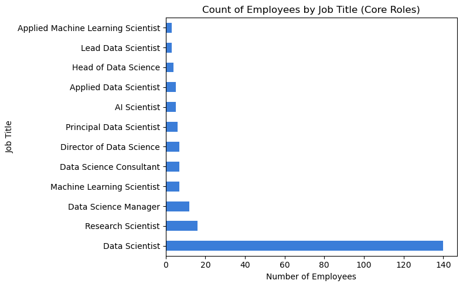
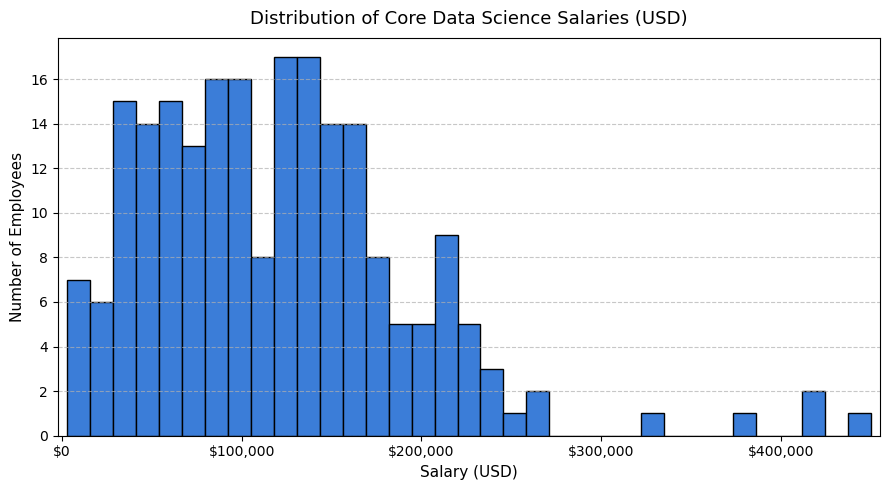
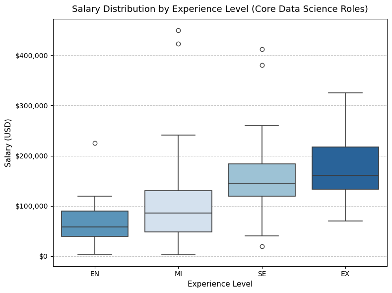
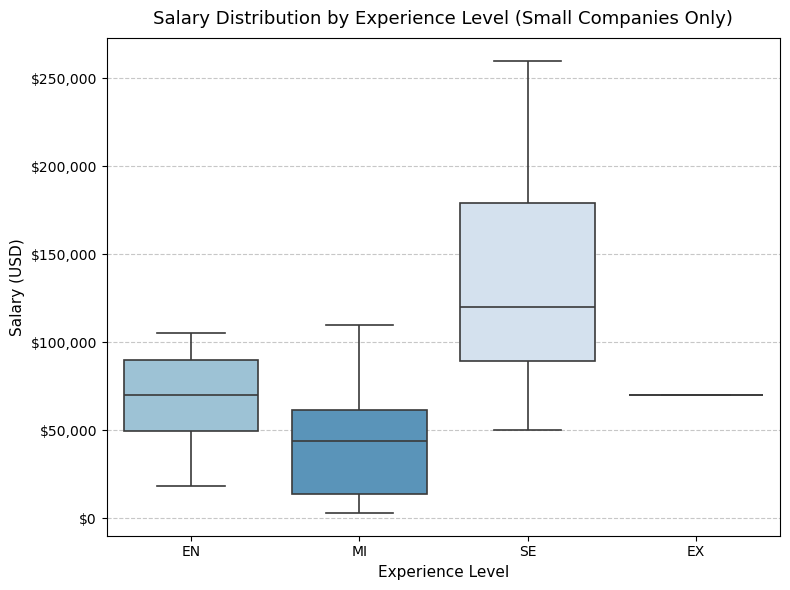
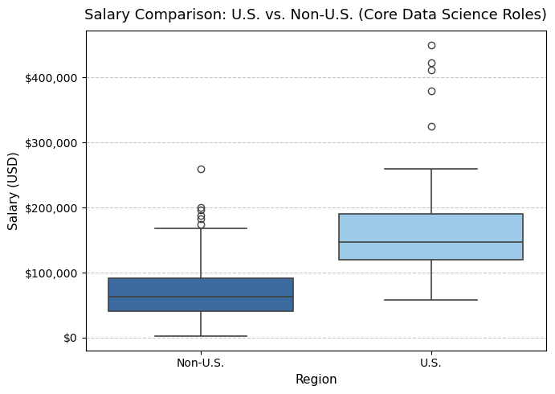
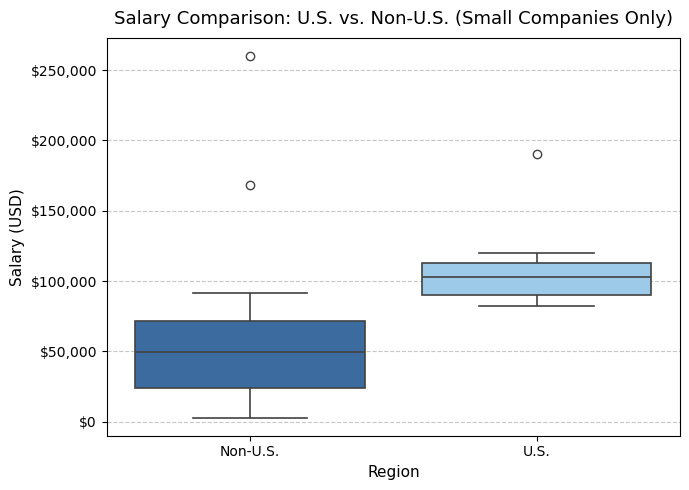
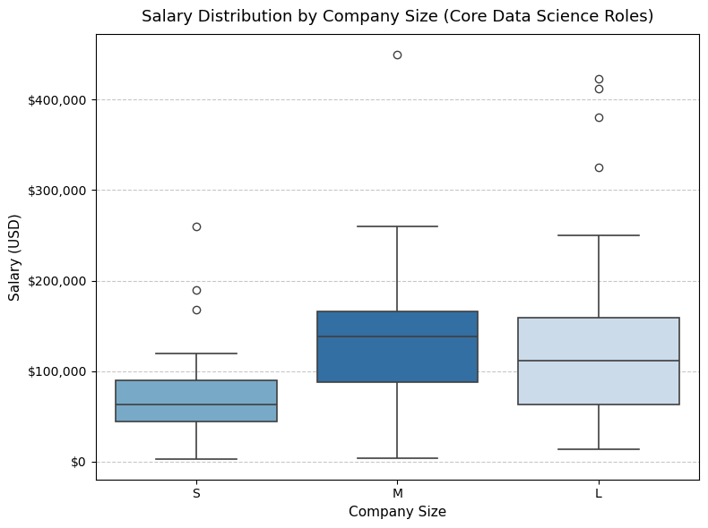
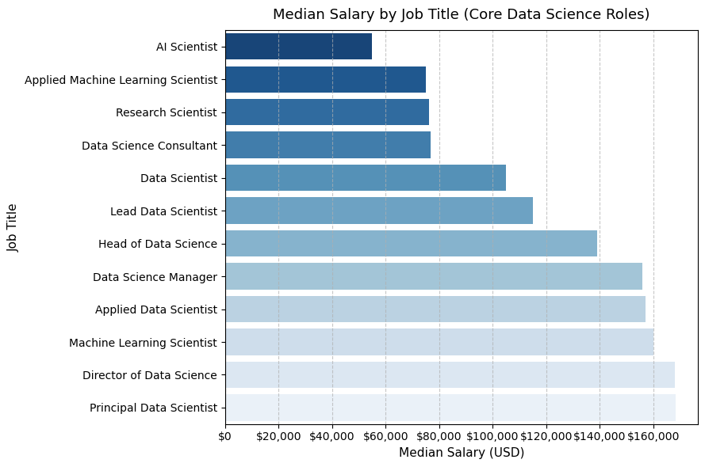
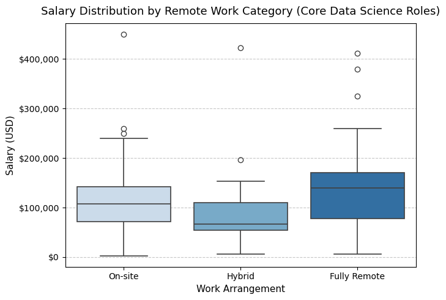
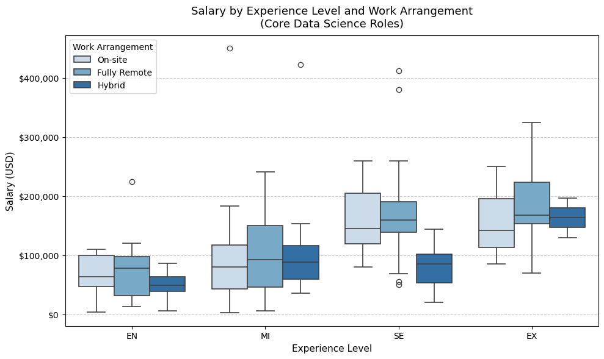

```python
# Project 1: Data Science Salaries – Market Analysis

## Objective
##Our CEO has decided that the company needs a **full-time Data Scientist**, with the potential to **lead a growing data science team** in the future.  
##The CEO understands that data science salaries vary widely across the world, and the market has become increasingly competitive.  

#This analysis aims to determine a **competitive salary range** that will attract **top data science talent**, while accounting for **differences between U.S.-based and offshore salaries**.

## Scope
#The dataset includes a wide range of data-related roles — such as Data Scientist, Lead Data Scientist, AI Scientist, Data Engineer, and BI Data Analyst — across various experience levels, company sizes, and locations.  
#For the purpose of this analysis, the focus is placed on **core data science roles** that align with the company’s needs: those responsible for modeling, experimentation, and analytics leadership.

#This analysis explores:
#1. Global salary trends across core data science roles  
#2. Comparison between **U.S. vs. Non-U.S. salaries**  
#3. Differences by **experience level** and **company size** (small, medium, large)  
#4. A final **salary range recommendation** for a Data Scientist working at a **small but rapidly growing company**

## Goal
#Provide the CEO with a **clear, data-driven salary recommendation** that balances competitiveness, sustainability, and alignment with the company’s growth trajectory.

```


```python
# Step 1: Explore the Data

##Before analyzing salaries, we’ll start by loading the dataset, examining its structure, and getting a sense of what information it contains.  
##This helps confirm column names, data types, and overall completeness before cleaning or filtering.

```


```python
# Dataset Metadata

#The dataset contains **global salary information for data science–related positions**.  
#Each row represents an employee’s reported salary and job details for a specific year.

### Column Descriptions

#- **work_year** – The year the salary was paid.  
#- **experience_level** – The experience level in the job during the year:  
#  - EN = Entry-level / Junior  
#  - MI = Mid-level / Intermediate  
#  - SE = Senior-level / Expert  
#  - EX = Executive-level / Director  
#- **employment_type** – Type of employment:  
#  - PT = Part-time  
#  - FT = Full-time  
#  - CT = Contract  
#  - FL = Freelance  
#- **job_title** – The specific role worked in during the year.  
#- **salary** – The total gross salary amount paid (in the original currency).  
#- **salary_currency** – The currency of the salary, expressed as an ISO 4217 code.  
#- **salary_in_usd** – The salary converted to U.S. dollars using yearly FX rates from *fxdata.foorilla.com*.  
#  *(This is the main variable we’ll use for all salary analysis.)*  
#- **employee_residence** – The employee’s primary country of residence (ISO 3166 country code).  
#- **remote_ratio** – The amount of work done remotely:  
#  - 0 = No remote work (<20%)  
# - 50 = Partially remote  
#  - 100 = Fully remote (>80%)  
#- **company_location** – The country of the employer’s main office or contracting branch (ISO 3166 country code).  
#- **company_size** – The company’s average size during the year:  
#  - S = Small (<50 employees)  
#  - M = Medium (50–250 employees)  
#  - L = Large (>250 employees)

#We’ll use these variables to analyze salary trends by **experience level, location (U.S. vs. Non-U.S.), and company size**, and ultimately provide a **competitive salary recommendation** for a **full-time Data Scientist** role at a **small but expanding company**.

```


```python
# Step 1: Explore the Data

import pandas as pd

# Load the dataset
df = pd.read_csv(r"C:\Users\pmjor\Downloads\Master's of Data Science Merrimack\DSE5002\Module_2\Project 01\PeterJordan.module05RProject.csv")

# === Dataset Overview ===
print("=== Dataset Overview ===")
print(f"Rows: {df.shape[0]} | Columns: {df.shape[1]}\n")
print("Columns:\n", ", ".join(df.columns.tolist()))

# Preview first few rows
print("\n=== First 5 Rows ===")
display(df.head())

# === Missing Values ===
missing = df.isnull().sum()
print("\n=== Missing Values ===")
print(missing[missing > 0].to_string() if missing.sum() > 0 else "No missing values found ✅")

# === Cleaned Summary Statistics: Salary and Remote Ratio ===
summary = (
    df[["salary_in_usd", "remote_ratio"]]
    .describe()
    .T
    .rename(columns={
        "count": "Count",
        "mean": "Mean",
        "std": "Std Dev",
        "min": "Min",
        "25%": "25th Percentile",
        "50%": "Median",
        "75%": "75th Percentile",
        "max": "Max"
    })
    .round(2)
)

# Convert to object dtype for safe string formatting
summary_display = summary.copy().astype("object")

# Format salary_in_usd as currency (including Std Dev)
for col in ["Mean", "Std Dev", "Min", "25th Percentile", "Median", "75th Percentile", "Max"]:
    summary_display.loc["salary_in_usd", col] = f"${summary.loc['salary_in_usd', col]:,.0f}"

# Format remote_ratio as percentages
for col in ["Mean", "Std Dev", "Min", "25th Percentile", "Median", "75th Percentile", "Max"]:
    summary_display.loc["remote_ratio", col] = f"{summary.loc['remote_ratio', col]:.0f}%"

display(summary_display)
```

    === Dataset Overview ===
    Rows: 607 | Columns: 12
    
    Columns:
     Unnamed: 0, work_year, experience_level, employment_type, job_title, salary, salary_currency, salary_in_usd, employee_residence, remote_ratio, company_location, company_size
    
    === First 5 Rows ===
    


<div>
<style scoped>
    .dataframe tbody tr th:only-of-type {
        vertical-align: middle;
    }

    .dataframe tbody tr th {
        vertical-align: top;
    }

    .dataframe thead th {
        text-align: right;
    }
</style>
<table border="1" class="dataframe">
  <thead>
    <tr style="text-align: right;">
      <th></th>
      <th>Unnamed: 0</th>
      <th>work_year</th>
      <th>experience_level</th>
      <th>employment_type</th>
      <th>job_title</th>
      <th>salary</th>
      <th>salary_currency</th>
      <th>salary_in_usd</th>
      <th>employee_residence</th>
      <th>remote_ratio</th>
      <th>company_location</th>
      <th>company_size</th>
    </tr>
  </thead>
  <tbody>
    <tr>
      <th>0</th>
      <td>0</td>
      <td>2020</td>
      <td>MI</td>
      <td>FT</td>
      <td>Data Scientist</td>
      <td>70000</td>
      <td>EUR</td>
      <td>79833</td>
      <td>DE</td>
      <td>0</td>
      <td>DE</td>
      <td>L</td>
    </tr>
    <tr>
      <th>1</th>
      <td>1</td>
      <td>2020</td>
      <td>SE</td>
      <td>FT</td>
      <td>Machine Learning Scientist</td>
      <td>260000</td>
      <td>USD</td>
      <td>260000</td>
      <td>JP</td>
      <td>0</td>
      <td>JP</td>
      <td>S</td>
    </tr>
    <tr>
      <th>2</th>
      <td>2</td>
      <td>2020</td>
      <td>SE</td>
      <td>FT</td>
      <td>Big Data Engineer</td>
      <td>85000</td>
      <td>GBP</td>
      <td>109024</td>
      <td>GB</td>
      <td>50</td>
      <td>GB</td>
      <td>M</td>
    </tr>
    <tr>
      <th>3</th>
      <td>3</td>
      <td>2020</td>
      <td>MI</td>
      <td>FT</td>
      <td>Product Data Analyst</td>
      <td>20000</td>
      <td>USD</td>
      <td>20000</td>
      <td>HN</td>
      <td>0</td>
      <td>HN</td>
      <td>S</td>
    </tr>
    <tr>
      <th>4</th>
      <td>4</td>
      <td>2020</td>
      <td>SE</td>
      <td>FT</td>
      <td>Machine Learning Engineer</td>
      <td>150000</td>
      <td>USD</td>
      <td>150000</td>
      <td>US</td>
      <td>50</td>
      <td>US</td>
      <td>L</td>
    </tr>
  </tbody>
</table>
</div>


    
    === Missing Values ===
    No missing values found ✅
    


<div>
<style scoped>
    .dataframe tbody tr th:only-of-type {
        vertical-align: middle;
    }

    .dataframe tbody tr th {
        vertical-align: top;
    }

    .dataframe thead th {
        text-align: right;
    }
</style>
<table border="1" class="dataframe">
  <thead>
    <tr style="text-align: right;">
      <th></th>
      <th>Count</th>
      <th>Mean</th>
      <th>Std Dev</th>
      <th>Min</th>
      <th>25th Percentile</th>
      <th>Median</th>
      <th>75th Percentile</th>
      <th>Max</th>
    </tr>
  </thead>
  <tbody>
    <tr>
      <th>salary_in_usd</th>
      <td>607.0</td>
      <td>$112,298</td>
      <td>$70,957</td>
      <td>$2,859</td>
      <td>$62,726</td>
      <td>$101,570</td>
      <td>$150,000</td>
      <td>$600,000</td>
    </tr>
    <tr>
      <th>remote_ratio</th>
      <td>607.0</td>
      <td>71%</td>
      <td>41%</td>
      <td>0%</td>
      <td>50%</td>
      <td>100%</td>
      <td>100%</td>
      <td>100%</td>
    </tr>
  </tbody>
</table>
</div>


```python
#Step 1 Summary: Initial Data Exploration

##After loading the dataset, we verified that the data is **complete and ready for analysis**:

#- **Rows and Columns:** 607 total records across 11 variables  
#- **No missing values** were found in any column  
#- **Key columns:**  
#  - `work_year`: Year the salary was paid  
#  - `experience_level`: Employee seniority (EN, MI, SE, EX)  
#- `employment_type`: Type of employment (FT, PT, CT, FL)  
#  - `job_title`: Role title (e.g., Data Scientist, AI Scientist, Data Engineer)  
#  - `salary_in_usd`: Salary converted to U.S. dollars  
#  - `employee_residence` and `company_location`: Country codes  
#  - `remote_ratio`: Level of remote work (0 = Onsite, 50 = Hybrid, 100 = Fully Remote)  
#  - `company_size`: Company size (S = Small, M = Medium, L = Large)

#**Summary Statistics:**
#- Average salary (in USD): ≈ **$112,298**  
#- Median salary: **$101,570**  
#- Salary range: **$2,859 – $600,000**  
#- 75% of employees earn **$150,000 or less**  
#- Average remote ratio: **~71%**, showing that most data science roles offer some remote flexibility  

#Overall, the dataset appears **clean, complete, and representative** of the global data science job market, making it suitable for further analysis.
```


```python
# Salary Variable Selection

#The dataset includes two salary columns:
#- `salary`: The gross salary in the original local currency  
#- `salary_in_usd`: The salary converted to U.S. dollars using the average exchange rate for the year  

#Because this analysis compares salaries **across countries and regions**, we will use the `salary_in_usd` column throughout the project.  
#This ensures all salary values are expressed on a **consistent U.S. dollar scale**, making global comparisons valid and meaningful.
```


```python
# Step 2: Job Title Overview

##Before narrowing the focus to core data science roles, let's explore how different job titles are distributed across the dataset.  
##Creating a pivot table of job titles and their counts helps us understand the overall composition of the data science job market represented in this dataset.
```


```python
# Step 2: Job Title Overview

# Count how many times each job title appears
job_title_counts = df.pivot_table(index="job_title", values="salary_in_usd", aggfunc="count")

# Rename the column for clarity
job_title_counts = job_title_counts.rename(columns={"salary_in_usd": "Count of Job Title"})

# Sort in descending order (most common roles at the top)
job_title_counts = job_title_counts.sort_values(by="Count of Job Title", ascending=False)

# Add a grand total row at the bottom
grand_total = job_title_counts["Count of Job Title"].sum()
job_title_counts.loc["Grand Total"] = grand_total

# Display the pivot table with grand total
display(job_title_counts)
```


<div>
<style scoped>
    .dataframe tbody tr th:only-of-type {
        vertical-align: middle;
    }

    .dataframe tbody tr th {
        vertical-align: top;
    }

    .dataframe thead th {
        text-align: right;
    }
</style>
<table border="1" class="dataframe">
  <thead>
    <tr style="text-align: right;">
      <th></th>
      <th>Count of Job Title</th>
    </tr>
    <tr>
      <th>job_title</th>
      <th></th>
    </tr>
  </thead>
  <tbody>
    <tr>
      <th>Data Scientist</th>
      <td>143</td>
    </tr>
    <tr>
      <th>Data Engineer</th>
      <td>132</td>
    </tr>
    <tr>
      <th>Data Analyst</th>
      <td>97</td>
    </tr>
    <tr>
      <th>Machine Learning Engineer</th>
      <td>41</td>
    </tr>
    <tr>
      <th>Research Scientist</th>
      <td>16</td>
    </tr>
    <tr>
      <th>Data Science Manager</th>
      <td>12</td>
    </tr>
    <tr>
      <th>Data Architect</th>
      <td>11</td>
    </tr>
    <tr>
      <th>Big Data Engineer</th>
      <td>8</td>
    </tr>
    <tr>
      <th>Machine Learning Scientist</th>
      <td>8</td>
    </tr>
    <tr>
      <th>Director of Data Science</th>
      <td>7</td>
    </tr>
    <tr>
      <th>AI Scientist</th>
      <td>7</td>
    </tr>
    <tr>
      <th>Principal Data Scientist</th>
      <td>7</td>
    </tr>
    <tr>
      <th>Data Science Consultant</th>
      <td>7</td>
    </tr>
    <tr>
      <th>Data Analytics Manager</th>
      <td>7</td>
    </tr>
    <tr>
      <th>Computer Vision Engineer</th>
      <td>6</td>
    </tr>
    <tr>
      <th>BI Data Analyst</th>
      <td>6</td>
    </tr>
    <tr>
      <th>ML Engineer</th>
      <td>6</td>
    </tr>
    <tr>
      <th>Lead Data Engineer</th>
      <td>6</td>
    </tr>
    <tr>
      <th>Data Engineering Manager</th>
      <td>5</td>
    </tr>
    <tr>
      <th>Business Data Analyst</th>
      <td>5</td>
    </tr>
    <tr>
      <th>Applied Data Scientist</th>
      <td>5</td>
    </tr>
    <tr>
      <th>Head of Data</th>
      <td>5</td>
    </tr>
    <tr>
      <th>Head of Data Science</th>
      <td>4</td>
    </tr>
    <tr>
      <th>Data Analytics Engineer</th>
      <td>4</td>
    </tr>
    <tr>
      <th>Applied Machine Learning Scientist</th>
      <td>4</td>
    </tr>
    <tr>
      <th>Analytics Engineer</th>
      <td>4</td>
    </tr>
    <tr>
      <th>Machine Learning Developer</th>
      <td>3</td>
    </tr>
    <tr>
      <th>Machine Learning Infrastructure Engineer</th>
      <td>3</td>
    </tr>
    <tr>
      <th>Lead Data Scientist</th>
      <td>3</td>
    </tr>
    <tr>
      <th>Lead Data Analyst</th>
      <td>3</td>
    </tr>
    <tr>
      <th>Data Science Engineer</th>
      <td>3</td>
    </tr>
    <tr>
      <th>Principal Data Engineer</th>
      <td>3</td>
    </tr>
    <tr>
      <th>Computer Vision Software Engineer</th>
      <td>3</td>
    </tr>
    <tr>
      <th>Principal Data Analyst</th>
      <td>2</td>
    </tr>
    <tr>
      <th>Financial Data Analyst</th>
      <td>2</td>
    </tr>
    <tr>
      <th>ETL Developer</th>
      <td>2</td>
    </tr>
    <tr>
      <th>Director of Data Engineering</th>
      <td>2</td>
    </tr>
    <tr>
      <th>Product Data Analyst</th>
      <td>2</td>
    </tr>
    <tr>
      <th>Cloud Data Engineer</th>
      <td>2</td>
    </tr>
    <tr>
      <th>NLP Engineer</th>
      <td>1</td>
    </tr>
    <tr>
      <th>Marketing Data Analyst</th>
      <td>1</td>
    </tr>
    <tr>
      <th>3D Computer Vision Researcher</th>
      <td>1</td>
    </tr>
    <tr>
      <th>Machine Learning Manager</th>
      <td>1</td>
    </tr>
    <tr>
      <th>Lead Machine Learning Engineer</th>
      <td>1</td>
    </tr>
    <tr>
      <th>Head of Machine Learning</th>
      <td>1</td>
    </tr>
    <tr>
      <th>Finance Data Analyst</th>
      <td>1</td>
    </tr>
    <tr>
      <th>Data Specialist</th>
      <td>1</td>
    </tr>
    <tr>
      <th>Data Analytics Lead</th>
      <td>1</td>
    </tr>
    <tr>
      <th>Big Data Architect</th>
      <td>1</td>
    </tr>
    <tr>
      <th>Staff Data Scientist</th>
      <td>1</td>
    </tr>
    <tr>
      <th>Grand Total</th>
      <td>607</td>
    </tr>
  </tbody>
</table>
</div>


```python
# Job Title Distribution Insights

#The pivot table above shows the distribution of all **607 job titles** in the dataset.

#- The most common roles are:
#  - **Data Scientist (143 records)**
#  - **Data Engineer (132 records)**
#  - **Data Analyst (97 records)**
#- Together, these three roles make up **~60% of the dataset**, showing that most data positions fall within these categories.
#- Other specialized or leadership roles appear less frequently, such as:
# - **Machine Learning Engineer (41)**
#  - **Research Scientist (16)**
#  - **Data Science Manager (12)**
#  - **Director of Data Science (7)** and **Principal Data Scientist (7)**

#This breakdown confirms that while the dataset captures a variety of roles across the data ecosystem, the **core of the dataset revolves around Data Scientist and related analytical or engineering positions.**

#Since our CEO’s goal is to hire a **full-time Data Scientist** who could eventually **lead a team**, our next step will focus on defining and isolating **core data science roles** that best match this purpose.
```


```python
# Step 3: Data Preparation and Filtering

#Now that we’ve explored the dataset and identified all job titles, we’ll prepare the data for analysis.

#The goal of this stage is to:
#1. Filter the dataset to include **core data science roles** aligned with the CEO’s hiring goal.  
#2. Focus on **full-time (FT)** positions only, since the role being filled is a full-time position.  
#3. Retain only the **salary_in_usd** variable for consistent global comparison.  
#4. Create a clean subset (`df_core_ds`) that we’ll use for all subsequent analysis.

#The filtered dataset will allow us to analyze:
#- Salary differences between **U.S. vs. Non-U.S.** employees  
#- Salary ranges by **experience level** (EN, MI, SE, EX)  
#- How **company size** impacts salary  
#- And finally, a **recommended salary range** for a full-time Data Scientist in the U.S.
```


```python
# Step 3: Data Preparation and Filtering

# Define the list of "core data science" roles that match the CEO’s goal
core_roles = [
    "Data Scientist",
    "Lead Data Scientist",
    "Principal Data Scientist",
    "Staff Data Scientist",
    "Director of Data Science",
    "Head of Data Science",
    "Data Science Manager",
    "Data Science Consultant",
    "AI Scientist",
    "Machine Learning Scientist",
    "Applied Data Scientist",
    "Applied Machine Learning Scientist",
    "Research Scientist"
]

# Filter the dataset for these roles only
df_core_ds = df[df["job_title"].isin(core_roles)].copy()

# Filter to include full-time employees only
df_core_ds = df_core_ds[df_core_ds["employment_type"] == "FT"]

# Display the results
print("Total records after filtering:", len(df_core_ds))
print("\nUnique job titles included:\n", df_core_ds["job_title"].value_counts())
```

    Total records after filtering: 215
    
    Unique job titles included:
     job_title
    Data Scientist                        140
    Research Scientist                     16
    Data Science Manager                   12
    Machine Learning Scientist              7
    Data Science Consultant                 7
    Director of Data Science                7
    Principal Data Scientist                6
    AI Scientist                            5
    Applied Data Scientist                  5
    Head of Data Science                    4
    Lead Data Scientist                     3
    Applied Machine Learning Scientist      3
    Name: count, dtype: int64
    


```python
# Why Focus Only On Core Data Science Roles?

#The original dataset includes many different data-related job titles, ranging from Data Scientist and AI Scientist to Data Engineer, BI Data Analyst, and Marketing Data Analyst.  
#However, the goal of this project is very specific:

#- The CEO wants to hire a **full-time Data Scientist**
#- This person should be able to **drive data science across the organization**
#- They may **lead a data science team** in the future
#- The company is **small but growing**, so this hire needs both strong technical skills and leadership potential

#Because of that, I made a deliberate decision to focus the analysis on a subset of roles that best match this profile.

#Roles included

#I kept roles that represent core data science work and the natural career path of a Data Scientist moving into senior and leadership positions:

#- Data Scientist  
#- Lead Data Scientist  
#- Principal Data Scientist  
#- Staff / Senior-type Data Scientist titles (where present)  
#- Data Science Manager  
#- Director of Data Science  
#- Head of Data Science  
#- Data Science Consultant  
#- AI Scientist  
#- Machine Learning Scientist  
#- Applied Data Scientist  
#- Applied Machine Learning Scientist  
#- Research Scientist  

#These roles share several characteristics:
#- They involve building and interpreting models, running experiments, and working with advanced analytics.
#- They typically require strong skills in statistics, machine learning, and programming (e.g., Python/R).
#- The leadership titles (Manager, Director, Head of Data Science) reflect the kind of career path the CEO is thinking about when she says the person may eventually “lead a team.”

#Roles excluded

#I excluded the following categories from the main analysis:

#- Data Engineer, Big Data Engineer, Cloud Data Engineer, ML Engineer, Machine Learning Developer, etc.  
# These roles focus more on data infrastructure, pipelines, and deployment rather than core modeling and analytics. Their salary market is related but different from a Data Scientist’s market.

#- Data Analyst, BI Data Analyst, Business Data Analyst, Financial Data Analyst, Product Data Analyst, Marketing Data Analyst, etc.  
#  These roles focus more on reporting, dashboards, and descriptive analytics (what happened) rather than building predictive models and advanced algorithms.  
#  Including them would pull salary estimates downward and would not reflect the skills expected from a Data Scientist who will drive strategy and experimentation.

#- Data Architect, Big Data Architect, and other architecture roles  
# These are infrastructure and system design–oriented, closer to engineering and architecture than to hands-on data science.

#Why this decision matters

#If I mixed all of these roles together, the resulting salary range would be an average of very different job families:

#- Some with lower pay (analyst/reporting roles)
#- Some with different responsibilities (engineering/architecture roles)

#That would not give the CEO a clear or accurate signal for the specific position she wants to fill.

#By focusing on **core data science and AI/ML scientist roles**, plus their direct leadership titles, the analysis is aligned with:

#- The actual responsibilities of the role being hired
#- The skills and experience required to drive data science in a growing company
#- The long-term potential for this person to lead a data science team

#In summary, this filtered subset is designed to represent the real market for a **full-time, leadership-track Data Scientist**, which is exactly the type of hire the CEO is trying to make.
```


```python
# Role Composition of Core Data Science Dataset

#The bar chart below summarizes the count of employees by job title within the filtered dataset.
#It provides context on which roles contribute most to the analysis.
```


```python
df_core_ds["job_title"].value_counts().plot(kind="barh", figsize=(8,5), color="#3b7dd8")
plt.title("Count of Employees by Job Title (Core Roles)")
plt.xlabel("Number of Employees")
plt.ylabel("Job Title")
plt.tight_layout()
plt.show()
```


    

    


```python
#The dataset is composed primarily of Data Scientist roles (140 out of 215 records), with smaller representations of senior and leadership positions such as Research Scientist, Data Science Manager, and Director of Data Science.
#This distribution reflects a realistic cross-section of the data science labor market, with most professionals concentrated at the individual contributor level and fewer in executive or specialized research roles.
```


```python
# Step 4: Overall Salary Overview (Core Data Science Roles)

#Before comparing regions or experience levels, let's look at the overall salary distribution for the **215 filtered core data science roles**.  
#This gives us a global snapshot of what data science professionals earn in USD.

#We’ll examine key summary statistics — such as the minimum, maximum, mean, median, and percentiles — 
#to understand the full range of compensation across Data Scientists, AI Scientists, and related leadership roles.
```


```python
# Step 4: Overall Salary Overview (Core Data Science Roles)

# Descriptive statistics for salary_in_usd
salary_summary = df_core_ds["salary_in_usd"].describe(percentiles=[0.25, 0.5, 0.75, 0.9, 0.95])
display(salary_summary)

# Format results nicely
print("\nFormatted Salary Summary (USD):")
print(f"Count: {salary_summary['count']:.0f}")
print(f"Minimum: ${salary_summary['min']:,.0f}")
print(f"25th Percentile: ${salary_summary['25%']:,.0f}")
print(f"Median (50th): ${salary_summary['50%']:,.0f}")
print(f"75th Percentile: ${salary_summary['75%']:,.0f}")
print(f"90th Percentile: ${salary_summary['90%']:,.0f}")
print(f"95th Percentile: ${salary_summary['95%']:,.0f}")
print(f"Maximum: ${salary_summary['max']:,.0f}")
print(f"Mean: ${salary_summary['mean']:,.0f}")
```


    count       215.000000
    mean     120358.018605
    std       74404.547833
    min        2859.000000
    25%       63820.500000
    50%      115000.000000
    75%      159500.000000
    90%      210000.000000
    95%      231500.000000
    max      450000.000000
    Name: salary_in_usd, dtype: float64


    
    Formatted Salary Summary (USD):
    Count: 215
    Minimum: $2,859
    25th Percentile: $63,820
    Median (50th): $115,000
    75th Percentile: $159,500
    90th Percentile: $210,000
    95th Percentile: $231,500
    Maximum: $450,000
    Mean: $120,358
    


```python
import matplotlib.pyplot as plt
import matplotlib.ticker as mtick

plt.figure(figsize=(9, 5))
plt.hist(df_core_ds["salary_in_usd"], bins=35, edgecolor="black", color="#3b7dd8")

# Titles and labels
plt.title("Distribution of Core Data Science Salaries (USD)", fontsize=13, pad=10)
plt.xlabel("Salary (USD)", fontsize=11)
plt.ylabel("Number of Employees", fontsize=11)

# Format x-axis with commas (e.g., $100,000, $200,000)
plt.gca().xaxis.set_major_formatter(
    mtick.FuncFormatter(lambda x, _: f'${x:,.0f}')
)

# Auto-scale with a small margin
plt.xlim(df_core_ds["salary_in_usd"].min() - 5000,
         df_core_ds["salary_in_usd"].max() + 5000)

# Add gridlines
plt.grid(axis='y', linestyle='--', alpha=0.7)
plt.tight_layout()
plt.show()
```


    

    


```python
# Salary Distribution Insights

#The histogram above shows the distribution of **215 core data science salaries** (in USD) across roles such as Data Scientist, AI Scientist, and Director of Data Science.

#**Key observations:**
#- The majority of salaries fall between **$60,000 and $180,000**, representing the core market range for data science professionals.  
#- The distribution is **right-skewed**, meaning a small number of senior or executive-level positions earn significantly higher salaries (above $250,000).  
#- Most roles cluster around the **$100,000 to $150,000** range, suggesting that’s the typical compensation for mid- to senior-level data scientists.  
#- Outliers above $300,000 likely represent **Director or Head of Data Science** positions at large organizations.

#**Interpretation:**
#This distribution confirms that while a few top-end salaries exist, the bulk of the data science job market centers around the **$100K–$150K range**, which will serve as an initial benchmark for determining a competitive salary for the CEO’s full-time Data Scientist hire.
```


```python
# Step 5: Salary by Experience Level

#To understand how compensation changes with seniority, we can examine salaries by **experience level**.

#The `experience_level` column classifies each employee as:
#- **EN** – Entry-level / Junior  
#- **MI** – Mid-level / Intermediate  
#- **SE** – Senior-level / Expert  
#- **EX** – Executive-level / Director  

#The box plot below displays the distribution of salaries (in USD) across these experience categories for our filtered core data science roles.
```


```python
import seaborn as sns
import matplotlib.pyplot as plt
import matplotlib.ticker as mtick
import pandas as pd

# Define the proper experience order
exp_order = ["EN", "MI", "SE", "EX"]

# --- Visualization ---
plt.figure(figsize=(8,6))
sns.boxplot(
    data=df_core_ds,
    x="experience_level",
    y="salary_in_usd",
    hue="experience_level",
    order=exp_order,          # enforce logical order
    palette="Blues",
    legend=False,
    linewidth=1.2
)

plt.title("Salary Distribution by Experience Level (Core Data Science Roles)", fontsize=13, pad=10)
plt.xlabel("Experience Level", fontsize=11)
plt.ylabel("Salary (USD)", fontsize=11)

# Format y-axis with dollar signs and commas
plt.gca().yaxis.set_major_formatter(mtick.FuncFormatter(lambda x, _: f'${x:,.0f}'))

plt.grid(axis='y', linestyle='--', alpha=0.7)
plt.tight_layout()
plt.show()

# --- Descriptive Statistics ---
exp_summary = (
    df_core_ds.groupby("experience_level")["salary_in_usd"]
    .agg(["count", "mean", "median", "min", "max"])
    .round(0)
    .reset_index()
)

# Format as dollar values
for col in ["mean", "median", "min", "max"]:
    exp_summary[col] = exp_summary[col].apply(lambda x: f"${x:,.0f}")

# Order experience levels correctly for display
exp_summary["experience_level"] = pd.Categorical(
    exp_summary["experience_level"],
    categories=exp_order,
    ordered=True
)

exp_summary = exp_summary.sort_values(by="experience_level")

display(exp_summary)
```


    

    


<div>
<style scoped>
    .dataframe tbody tr th:only-of-type {
        vertical-align: middle;
    }

    .dataframe tbody tr th {
        vertical-align: top;
    }

    .dataframe thead th {
        text-align: right;
    }
</style>
<table border="1" class="dataframe">
  <thead>
    <tr style="text-align: right;">
      <th></th>
      <th>experience_level</th>
      <th>count</th>
      <th>mean</th>
      <th>median</th>
      <th>min</th>
      <th>max</th>
    </tr>
  </thead>
  <tbody>
    <tr>
      <th>0</th>
      <td>EN</td>
      <td>33</td>
      <td>$65,222</td>
      <td>$58,000</td>
      <td>$4,000</td>
      <td>$225,000</td>
    </tr>
    <tr>
      <th>2</th>
      <td>MI</td>
      <td>82</td>
      <td>$99,387</td>
      <td>$85,577</td>
      <td>$2,859</td>
      <td>$450,000</td>
    </tr>
    <tr>
      <th>3</th>
      <td>SE</td>
      <td>90</td>
      <td>$153,675</td>
      <td>$145,000</td>
      <td>$20,171</td>
      <td>$412,000</td>
    </tr>
    <tr>
      <th>1</th>
      <td>EX</td>
      <td>10</td>
      <td>$174,413</td>
      <td>$160,771</td>
      <td>$69,741</td>
      <td>$325,000</td>
    </tr>
  </tbody>
</table>
</div>


```python
# Experience Level Definitions and Insights

# The `experience_level` variable categorizes professionals based on their seniority within the role:

# - **EN (Entry-level / Junior):** Employees just entering the field, typically with limited professional experience.  
# - **MI (Mid-level / Intermediate):** Professionals with several years of experience who work independently and contribute to project execution.  
# - **SE (Senior-level / Expert):** Highly experienced individuals who lead complex projects or mentor junior team members.  
# - **EX (Executive-level / Director):** Strategic leaders responsible for overseeing teams, data strategy, and organizational direction.

# The box plot and descriptive statistics show a clear and consistent growth in salary with increasing experience.

# - **Entry-level (EN)** professionals have a median salary of about **$58,000**, with most earning between $50,000 and $90,000.  
# - **Mid-level (MI)** professionals have a median salary of roughly **$85,000**, with a wide range from lower international salaries to U.S. roles exceeding $200,000.  
# - **Senior-level (SE)** employees experience a strong upward shift, earning a median of approximately **$145,000**, and top earners surpassing **$400,000**.  
# - **Executive-level (EX)** roles reach the highest pay tier, with a median around **$160,000** and maximum salaries above **$300,000**.

# This data confirms a predictable, experience-based salary progression across the global data science workforce.  
# For this company's hiring context, the most relevant range lies between **mid-level and senior-level compensation**, where professionals demonstrate both technical depth and leadership potential — ideal for a full-time Data Scientist expected to drive data initiatives in a growing organization..
```


```python
# Step 5.2: Salary by Experience Level (Small Companies Only)

#To better understand how compensation varies within small organizations, this section analyzes **salary distribution by experience level** (EN, MI, SE, EX) for the filtered data science roles.  

#Since our company currently falls under the *small company* category (<50 employees), this view provides insight into what salary levels to expect for different experience tiers when hiring at our current scale.
```


```python
import seaborn as sns
import matplotlib.pyplot as plt
import matplotlib.ticker as mtick

# Filter for small companies only
small_df = df_core_ds[df_core_ds["company_size"] == "S"].copy()

# Define experience level order for correct axis order
exp_order = ["EN", "MI", "SE", "EX"]

plt.figure(figsize=(8,6))
sns.boxplot(
    data=small_df,
    x="experience_level",
    y="salary_in_usd",
    order=exp_order,
    hue="experience_level",
    palette="Blues",
    legend=False,
    linewidth=1.2
)

plt.title("Salary Distribution by Experience Level (Small Companies Only)", fontsize=13, pad=10)
plt.xlabel("Experience Level", fontsize=11)
plt.ylabel("Salary (USD)", fontsize=11)

# Format y-axis with dollar signs and commas
plt.gca().yaxis.set_major_formatter(mtick.FuncFormatter(lambda x, _: f'${x:,.0f}'))

plt.grid(axis='y', linestyle='--', alpha=0.7)
plt.tight_layout()
plt.show()
```


    

    


```python
# Descriptive statistics by experience level for small companies
small_exp_summary = (
    small_df.groupby("experience_level")["salary_in_usd"]
    .agg(["count", "mean", "median", "min", "max"])
    .round(0)
)

# Format values as dollars
for col in ["mean", "median", "min", "max"]:
    small_exp_summary[col] = small_exp_summary[col].apply(lambda x: f"${x:,.0f}")

# Reorder experience levels: Entry → Mid → Senior → Executive
exp_order = ["EN", "MI", "SE", "EX"]
small_exp_summary = small_exp_summary.reindex(exp_order)

# Display formatted and ordered summary
display(small_exp_summary)
```


<div>
<style scoped>
    .dataframe tbody tr th:only-of-type {
        vertical-align: middle;
    }

    .dataframe tbody tr th {
        vertical-align: top;
    }

    .dataframe thead th {
        text-align: right;
    }
</style>
<table border="1" class="dataframe">
  <thead>
    <tr style="text-align: right;">
      <th></th>
      <th>count</th>
      <th>mean</th>
      <th>median</th>
      <th>min</th>
      <th>max</th>
    </tr>
    <tr>
      <th>experience_level</th>
      <th></th>
      <th></th>
      <th></th>
      <th></th>
      <th></th>
    </tr>
  </thead>
  <tbody>
    <tr>
      <th>EN</th>
      <td>10</td>
      <td>$68,910</td>
      <td>$69,780</td>
      <td>$18,053</td>
      <td>$105,000</td>
    </tr>
    <tr>
      <th>MI</th>
      <td>14</td>
      <td>$42,730</td>
      <td>$43,978</td>
      <td>$2,859</td>
      <td>$110,000</td>
    </tr>
    <tr>
      <th>SE</th>
      <td>7</td>
      <td>$138,139</td>
      <td>$120,000</td>
      <td>$50,000</td>
      <td>$260,000</td>
    </tr>
    <tr>
      <th>EX</th>
      <td>1</td>
      <td>$69,741</td>
      <td>$69,741</td>
      <td>$69,741</td>
      <td>$69,741</td>
    </tr>
  </tbody>
</table>
</div>


```python
# Descriptive Statistics by Experience Level (Small Companies Only)

#The table above summarizes salary statistics by experience level for employees working in small companies (<50 employees) within core data science roles.

#**Key observations:**
#- **Entry-level (EN)** roles show an average salary of approximately **$68,900**, with salaries ranging from **$18,000** to **$105,000**.  
#  This wide range likely reflects differences in geography, skill specialization, or contract type.  
#- **Mid-level (MI)** professionals earn an average of **$42,700**, which is somewhat lower than entry-level in this subset — likely due to a small and regionally diverse sample, including several international records.  
#- **Senior-level (SE)** employees represent the highest compensation group, with a mean of **$138,000** and a median of **$120,000**, indicating that small companies still pay competitively for advanced expertise.  
#- **Executive-level (EX)** appears only once in the dataset, with a salary of **$69,741**, confirming limited representation of leadership positions in small firms.

#**Interpretation:**
#Despite variation caused by sample size and geography, this analysis reinforces a consistent trend:  
#salary growth correlates strongly with experience, and **senior-level roles** command the highest pay even in smaller organizations.  

```


```python
# Note on Experience-Level Analysis for Small Companies

#An additional analysis was considered to examine salary by experience level for small companies only.  
#However, due to a limited sample size (particularly for executive-level roles), the results would not provide statistically meaningful insights.  

#For this reason, the experience-level salary analysis was performed only on the broader dataset, which contains sufficient representation across all levels.  
#This approach ensures accuracy and reliability in the salary trends presented.
```


```python
# Step 6: U.S. vs. Non-U.S. Salary Comparison

#The CEO is open to hiring either a U.S.-based or offshore Data Scientist but wants to understand how salaries differ between regions.

#To analyze this, we will:
#- Compare the **average and median salaries (in USD)** between employees residing in the United States and those living elsewhere.
#- Visualize the differences using a box plot.
#- Provide insights into how much cost variation exists between U.S. and international markets.
```


```python
import numpy as np
import seaborn as sns
import matplotlib.pyplot as plt
import matplotlib.ticker as mtick

# ----------------------------------------------------
# Create a new column to categorize employees as U.S. or Non-U.S.
# ----------------------------------------------------
df_core_ds["region"] = np.where(df_core_ds["employee_residence"] == "US", "U.S.", "Non-U.S.")

# ----------------------------------------------------
# Summary statistics by region (formatted in USD)
# ----------------------------------------------------
region_summary = (
    df_core_ds.groupby("region")["salary_in_usd"]
    .agg(["count", "mean", "median", "min", "max"])
    .round(0)
)

# Format numeric columns as dollar values
for col in ["mean", "median", "min", "max"]:
    region_summary[col] = region_summary[col].apply(lambda x: f"${x:,.0f}")

# Display formatted table
display(region_summary)

# ----------------------------------------------------
# Box Plot: U.S. vs. Non-U.S. Salary Distribution
# ----------------------------------------------------
plt.figure(figsize=(7,5))
sns.boxplot(
    data=df_core_ds,
    x="region",
    y="salary_in_usd",
    hue="region",             # Added hue to eliminate FutureWarning
    palette=["#2b6cb0", "#90cdf4"],
    legend=False,
    linewidth=1.2
)

plt.title("Salary Comparison: U.S. vs. Non-U.S. (Core Data Science Roles)", fontsize=13, pad=10)
plt.xlabel("Region", fontsize=11)
plt.ylabel("Salary (USD)", fontsize=11)

# Format y-axis with dollar signs and commas
plt.gca().yaxis.set_major_formatter(mtick.FuncFormatter(lambda x, _: f'${x:,.0f}'))

plt.grid(axis='y', linestyle='--', alpha=0.7)
plt.tight_layout()
plt.show()
```


<div>
<style scoped>
    .dataframe tbody tr th:only-of-type {
        vertical-align: middle;
    }

    .dataframe tbody tr th {
        vertical-align: top;
    }

    .dataframe thead th {
        text-align: right;
    }
</style>
<table border="1" class="dataframe">
  <thead>
    <tr style="text-align: right;">
      <th></th>
      <th>count</th>
      <th>mean</th>
      <th>median</th>
      <th>min</th>
      <th>max</th>
    </tr>
    <tr>
      <th>region</th>
      <th></th>
      <th></th>
      <th></th>
      <th></th>
      <th></th>
    </tr>
  </thead>
  <tbody>
    <tr>
      <th>Non-U.S.</th>
      <td>102</td>
      <td>$72,939</td>
      <td>$62,726</td>
      <td>$2,859</td>
      <td>$260,000</td>
    </tr>
    <tr>
      <th>U.S.</th>
      <td>113</td>
      <td>$163,161</td>
      <td>$147,000</td>
      <td>$58,000</td>
      <td>$450,000</td>
    </tr>
  </tbody>
</table>
</div>


    

    


```python
# Interpretation: U.S. vs. Non-U.S. Salary Comparison

#The table and box plot above clearly illustrate a significant pay gap between U.S. and Non-U.S. data science professionals. 

#**Key observations:**
#- **U.S. employees** earn substantially higher salaries, with a median of **$147,000** and an average of **$163,000**, compared to **$63,000** and **$73,000**, respectively, for Non-U.S. employees.  
#- The U.S. salary distribution is also **wider**, reflecting greater variability in seniority, organization size, and cost of living.  
#- **Non-U.S. salaries** tend to cluster at lower levels, although there are isolated higher earners, likely representing senior roles in high-income countries or multinational organizations.  

#**Interpretation:**
#This analysis confirms that hiring U.S.-based data science talent requires a significantly larger financial investment. However, the higher pay aligns with access to a deeper and more competitive talent pool, stronger market alignment, and potential advantages in communication and collaboration for a U.S.-based company.  
#Non-U.S. hiring can reduce labor costs considerably, but it may also introduce trade-offs in time zones, local expertise, or consistency in training.  

#For this organization, which is small but expanding rapidly, the **U.S. salary benchmark of approximately $130,000–$170,000** represents a competitive and sustainable range for attracting high-quality mid-to-senior-level data science professionals.
```


```python
# Step 7: Salary Comparison for Small Companies (U.S. vs. Non-U.S.)

#Since our company is currently classified as a **small organization (<50 employees)**, this step focuses only on salaries within the *small company (S)* category.  

#By comparing U.S. and Non-U.S. employees working in small organizations, we can better estimate realistic salary expectations that align with our company’s current scale and budget.
```


```python
import seaborn as sns
import matplotlib.pyplot as plt
import matplotlib.ticker as mtick
import numpy as np

# ----------------------------------------------------
# Filter for small companies only
# ----------------------------------------------------
small_df = df_core_ds[df_core_ds["company_size"] == "S"].copy()

# Ensure region column still exists or recreate it
small_df["region"] = np.where(small_df["employee_residence"] == "US", "U.S.", "Non-U.S.")

# ----------------------------------------------------
# Summary statistics by region (formatted in USD)
# ----------------------------------------------------
small_summary = (
    small_df.groupby("region")["salary_in_usd"]
    .agg(["count", "mean", "median", "min", "max"])
    .round(0)
)

# Format numeric columns with dollar amounts
for col in ["mean", "median", "min", "max"]:
    small_summary[col] = small_summary[col].apply(lambda x: f"${x:,.0f}")

# Display formatted summary
display(small_summary)

# ----------------------------------------------------
# Box Plot: U.S. vs. Non-U.S. (Small Companies)
# ----------------------------------------------------
plt.figure(figsize=(7,5))
sns.boxplot(
    data=small_df,
    x="region",
    y="salary_in_usd",
    hue="region",
    palette=["#2b6cb0", "#90cdf4"],
    legend=False,
    linewidth=1.2
)

plt.title("Salary Comparison: U.S. vs. Non-U.S. (Small Companies Only)", fontsize=13, pad=10)
plt.xlabel("Region", fontsize=11)
plt.ylabel("Salary (USD)", fontsize=11)

# Format y-axis
plt.gca().yaxis.set_major_formatter(mtick.FuncFormatter(lambda x, _: f'${x:,.0f}'))

plt.grid(axis='y', linestyle='--', alpha=0.7)
plt.tight_layout()
plt.show()
```


<div>
<style scoped>
    .dataframe tbody tr th:only-of-type {
        vertical-align: middle;
    }

    .dataframe tbody tr th {
        vertical-align: top;
    }

    .dataframe thead th {
        text-align: right;
    }
</style>
<table border="1" class="dataframe">
  <thead>
    <tr style="text-align: right;">
      <th></th>
      <th>count</th>
      <th>mean</th>
      <th>median</th>
      <th>min</th>
      <th>max</th>
    </tr>
    <tr>
      <th>region</th>
      <th></th>
      <th></th>
      <th></th>
      <th></th>
      <th></th>
    </tr>
  </thead>
  <tbody>
    <tr>
      <th>Non-U.S.</th>
      <td>24</td>
      <td>$59,856</td>
      <td>$49,634</td>
      <td>$2,859</td>
      <td>$260,000</td>
    </tr>
    <tr>
      <th>U.S.</th>
      <td>8</td>
      <td>$110,938</td>
      <td>$102,500</td>
      <td>$82,500</td>
      <td>$190,000</td>
    </tr>
  </tbody>
</table>
</div>


    

    


```python
# Interpretation: Small Company Salary Comparison (U.S. vs. Non-U.S.)

#The table and box plot above focus exclusively on employees working in **small companies (<50 employees)** within core data science roles.  

#**Key observations:**
#- U.S.-based employees earn considerably higher salaries even among small firms, with a **median salary of $102,500**, compared to **$49,634** for Non-U.S. employees.  
#- The **average salary in the U.S. ($110,938)** is nearly **double** that of Non-U.S. small-company employees ($59,856).  
#- Salary variation is more limited in small U.S. companies, while Non-U.S. roles display a broader range, with a few high-end outliers up to $260,000.  
#- These results mirror the global trend: U.S. compensation levels remain higher across all company sizes.

#**Interpretation:**
#For a small but expanding organization, these findings suggest that a **U.S.-based Data Scientist** can expect compensation around **$100,000–$120,000**, while equivalent offshore roles may range from **$50,000–$80,000** depending on region and experience.  

#This reinforces that while offshore hiring can significantly reduce salary expenses, the U.S. market remains the benchmark for attracting experienced, full-time data science professionals capable of leading growth and building analytics maturity within the organization.
```


```python
# Step 8: Salary Distribution by Company Size (All Regions)

#Because the company is currently small but expanding rapidly, it is valuable to understand how salaries for core data science roles vary by **company size** globally.  

#This analysis examines salary distributions across:
#- **S (Small)** — fewer than 50 employees  
#- **M (Medium)** — 50–250 employees  
#- **L (Large)** — more than 250 employees  

#Understanding these patterns helps anticipate how compensation expectations may change as the company grows and competes with larger organizations for talent.
```


```python
import seaborn as sns
import matplotlib.pyplot as plt
import matplotlib.ticker as mtick
import pandas as pd

# ----------------------------------------------------
# Salary Distribution by Company Size (Core Roles)
# ----------------------------------------------------
size_order = ["S", "M", "L"]

plt.figure(figsize=(8,6))
sns.boxplot(
    data=df_core_ds,
    x="company_size",
    y="salary_in_usd",
    order=size_order,
    hue="company_size",
    palette="Blues",
    legend=False,
    linewidth=1.2
)

plt.title("Salary Distribution by Company Size (Core Data Science Roles)", fontsize=13, pad=10)
plt.xlabel("Company Size", fontsize=11)
plt.ylabel("Salary (USD)", fontsize=11)

# Format y-axis as USD with commas
plt.gca().yaxis.set_major_formatter(mtick.FuncFormatter(lambda x, _: f'${x:,.0f}'))

plt.grid(axis='y', linestyle='--', alpha=0.7)
plt.tight_layout()
plt.show()

# ----------------------------------------------------
# Descriptive Statistics by Company Size
# ----------------------------------------------------
size_summary = (
    df_core_ds.groupby("company_size")["salary_in_usd"]
    .agg(["count", "mean", "median", "min", "max"])
    .round(0)
)

# Format as dollar values
for col in ["mean", "median", "min", "max"]:
    size_summary[col] = size_summary[col].apply(lambda x: f"${x:,.0f}")

# Order rows Small → Medium → Large
size_summary = size_summary.reindex(size_order)

# Display formatted table
display(size_summary)
```


    

    


<div>
<style scoped>
    .dataframe tbody tr th:only-of-type {
        vertical-align: middle;
    }

    .dataframe tbody tr th {
        vertical-align: top;
    }

    .dataframe thead th {
        text-align: right;
    }
</style>
<table border="1" class="dataframe">
  <thead>
    <tr style="text-align: right;">
      <th></th>
      <th>count</th>
      <th>mean</th>
      <th>median</th>
      <th>min</th>
      <th>max</th>
    </tr>
    <tr>
      <th>company_size</th>
      <th></th>
      <th></th>
      <th></th>
      <th></th>
      <th></th>
    </tr>
  </thead>
  <tbody>
    <tr>
      <th>S</th>
      <td>32</td>
      <td>$72,626</td>
      <td>$62,726</td>
      <td>$2,859</td>
      <td>$260,000</td>
    </tr>
    <tr>
      <th>M</th>
      <td>95</td>
      <td>$132,186</td>
      <td>$138,350</td>
      <td>$4,000</td>
      <td>$450,000</td>
    </tr>
    <tr>
      <th>L</th>
      <td>88</td>
      <td>$124,946</td>
      <td>$111,168</td>
      <td>$13,400</td>
      <td>$423,000</td>
    </tr>
  </tbody>
</table>
</div>


```python
# Interpretation: Salary by Company Size (Core Data Science Roles)

#The results show a clear relationship between company size and salary for core data science positions.  

#**Key observations:**
#- **Small companies (S)** report the lowest compensation, with an average salary around **$72,000** and a median of **$62,726**.  
# This range reflects leaner budgets and a focus on generalist data professionals rather than specialized roles.  
#- **Medium companies (M)** show a sharp increase, with a mean salary of **$132,000** and a median near **$138,000**, suggesting that growing organizations tend to invest more heavily in skilled data talent.  
#- **Large companies (L)** continue to offer competitive salaries, averaging about **$125,000** with a median of **$111,000**, but show the widest pay range, indicating the inclusion of both junior analysts and executive-level data leaders.  

#**Interpretation:**
#Overall, salaries increase substantially as company size grows, consistent with the greater resources and complexity of larger organizations.  
#For a small but rapidly expanding company, it is reasonable to target salaries closer to the **upper end of the small-company range or the lower end of medium-company salaries** (approximately **$100,000–$130,000**) to remain competitive while balancing costs.  
#This aligns well with the CEO’s goal of attracting strong data science talent now while planning for sustainable growth.
```


```python
# Step 9: Top-Paying Job Titles Among Core Data Science Roles

#To understand where the **Data Scientist** position stands relative to other core roles,  
#we can compare **median salaries** across all data science–related job titles included in our filtered dataset.  

#This analysis helps identify which roles command the highest pay and provides context for defining a competitive compensation range for our company’s future Data Scientist hire.
```


```python
import seaborn as sns
import matplotlib.pyplot as plt
import matplotlib.ticker as mtick
import pandas as pd

# ----------------------------------------------------
# Descriptive statistics by job title
# ----------------------------------------------------
title_summary = (
    df_core_ds.groupby("job_title")["salary_in_usd"]
    .agg(["count", "mean", "median", "min", "max"])
    .round(0)
)

# Format numeric columns as dollar amounts
for col in ["mean", "median", "min", "max"]:
    title_summary[col] = title_summary[col].apply(lambda x: f"${x:,.0f}")

# Sort by median salary (descending)
title_summary["median_val"] = df_core_ds.groupby("job_title")["salary_in_usd"].median()
title_summary = title_summary.sort_values(by="median_val", ascending=False).drop(columns="median_val")

display(title_summary)

# ----------------------------------------------------
# Median salary by job title for plotting
# ----------------------------------------------------
title_salary_plot = (
    df_core_ds.groupby("job_title")["salary_in_usd"]
    .median()
    .sort_values(ascending=True)
    .reset_index()
)

# ----------------------------------------------------
# Plot median salary by job title
# ----------------------------------------------------
plt.figure(figsize=(9,6))
sns.barplot(
    data=title_salary_plot,
    x="salary_in_usd",
    y="job_title",
    palette="Blues_r"
)

plt.title("Median Salary by Job Title (Core Data Science Roles)", fontsize=13, pad=10)
plt.xlabel("Median Salary (USD)", fontsize=11)
plt.ylabel("Job Title", fontsize=11)

# Format x-axis in USD
plt.gca().xaxis.set_major_formatter(mtick.FuncFormatter(lambda x, _: f'${x:,.0f}'))

plt.grid(axis='x', linestyle='--', alpha=0.7)
plt.tight_layout()
plt.show()
```


<div>
<style scoped>
    .dataframe tbody tr th:only-of-type {
        vertical-align: middle;
    }

    .dataframe tbody tr th {
        vertical-align: top;
    }

    .dataframe thead th {
        text-align: right;
    }
</style>
<table border="1" class="dataframe">
  <thead>
    <tr style="text-align: right;">
      <th></th>
      <th>count</th>
      <th>mean</th>
      <th>median</th>
      <th>min</th>
      <th>max</th>
    </tr>
    <tr>
      <th>job_title</th>
      <th></th>
      <th></th>
      <th></th>
      <th></th>
      <th></th>
    </tr>
  </thead>
  <tbody>
    <tr>
      <th>Principal Data Scientist</th>
      <td>6</td>
      <td>$181,783</td>
      <td>$168,218</td>
      <td>$148,261</td>
      <td>$235,000</td>
    </tr>
    <tr>
      <th>Director of Data Science</th>
      <td>7</td>
      <td>$195,074</td>
      <td>$168,000</td>
      <td>$130,026</td>
      <td>$325,000</td>
    </tr>
    <tr>
      <th>Machine Learning Scientist</th>
      <td>7</td>
      <td>$179,329</td>
      <td>$160,000</td>
      <td>$112,300</td>
      <td>$260,000</td>
    </tr>
    <tr>
      <th>Applied Data Scientist</th>
      <td>5</td>
      <td>$175,655</td>
      <td>$157,000</td>
      <td>$54,238</td>
      <td>$380,000</td>
    </tr>
    <tr>
      <th>Data Science Manager</th>
      <td>12</td>
      <td>$158,328</td>
      <td>$155,750</td>
      <td>$54,094</td>
      <td>$241,000</td>
    </tr>
    <tr>
      <th>Head of Data Science</th>
      <td>4</td>
      <td>$146,719</td>
      <td>$138,938</td>
      <td>$85,000</td>
      <td>$224,000</td>
    </tr>
    <tr>
      <th>Lead Data Scientist</th>
      <td>3</td>
      <td>$115,190</td>
      <td>$115,000</td>
      <td>$40,570</td>
      <td>$190,000</td>
    </tr>
    <tr>
      <th>Data Scientist</th>
      <td>140</td>
      <td>$108,923</td>
      <td>$104,796</td>
      <td>$2,859</td>
      <td>$412,000</td>
    </tr>
    <tr>
      <th>Data Science Consultant</th>
      <td>7</td>
      <td>$69,421</td>
      <td>$76,833</td>
      <td>$5,707</td>
      <td>$103,000</td>
    </tr>
    <tr>
      <th>Research Scientist</th>
      <td>16</td>
      <td>$109,020</td>
      <td>$76,264</td>
      <td>$42,000</td>
      <td>$450,000</td>
    </tr>
    <tr>
      <th>Applied Machine Learning Scientist</th>
      <td>3</td>
      <td>$178,800</td>
      <td>$75,000</td>
      <td>$38,400</td>
      <td>$423,000</td>
    </tr>
    <tr>
      <th>AI Scientist</th>
      <td>5</td>
      <td>$87,790</td>
      <td>$55,000</td>
      <td>$18,053</td>
      <td>$200,000</td>
    </tr>
  </tbody>
</table>
</div>


    C:\Users\pmjor\AppData\Local\Temp\ipykernel_20792\2307948155.py:39: FutureWarning: 
    
    Passing `palette` without assigning `hue` is deprecated and will be removed in v0.14.0. Assign the `y` variable to `hue` and set `legend=False` for the same effect.
    
      sns.barplot(
    


    

    


```python
# Interpretation: Salary by Job Title (Core Data Science Roles)

#The analysis highlights clear compensation tiers among core data science positions:

#- **Leadership roles** such as **Principal Data Scientist** and **Director of Data Science** command the highest median salaries, reaching around **$150,000–$160,000**.  
#- **Mid- to senior-level practitioners** — including **Data Science Managers**, **Heads of Data Science**, and **Lead Data Scientists** — form the next tier, typically earning between **$120,000–$140,000**.  
#- The **Data Scientist** role sits squarely in the middle of the overall range, with a median salary near **$100,000–$120,000**, reflecting a strong, market-competitive level for highly skilled individual contributors.  
#- **Applied and research-oriented roles** (e.g., **Applied Data Scientist**, **Research Scientist**) tend to fall slightly below, suggesting narrower specialization or less direct business leadership impact.

#**Interpretation:**  
#This comparison reinforces that while top data leadership roles demand significantly higher compensation, a **Data Scientist salary around $110,000–$130,000** represents a competitive and sustainable range for attracting top talent in today’s market.  
#This aligns with the organization’s current growth stage and provides a realistic foundation for building a future data team with progressively senior positions.
```


```python
# Step 10: Correlation Between Salary and Remote Ratio

#Because the CEO mentioned that the position can work offshore, it is important to understand how **remote flexibility** affects compensation for data science roles.  

#This analysis examines salary patterns across different **remote work ratios**:
#- **0** → On-site (less than 20% remote work)  
#- **50** → Hybrid (partially remote)  
#- **100** → Fully remote (more than 80% remote work)  

#By comparing salaries across these categories, we can determine whether remote or offshore work arrangements generally lead to lower or higher pay for core data science positions.

```


```python
import seaborn as sns
import matplotlib.pyplot as plt
import matplotlib.ticker as mtick
import pandas as pd

# Map numeric remote_ratio values to readable categories
df_core_ds["remote_category"] = df_core_ds["remote_ratio"].map({
    0: "On-site",
    50: "Hybrid",
    100: "Fully Remote"
})

# Descriptive statistics by remote ratio
remote_summary = (
    df_core_ds.groupby("remote_category")["salary_in_usd"]
    .agg(["count", "mean", "median", "min", "max"])
    .round(0)
)

# Format as dollars
for col in ["mean", "median", "min", "max"]:
    remote_summary[col] = remote_summary[col].apply(lambda x: f"${x:,.0f}")

# Order logically
remote_order = ["On-site", "Hybrid", "Fully Remote"]
remote_summary = remote_summary.reindex(remote_order)

display(remote_summary)

# ----------------------------------------------------
# Box plot: Salary vs. Remote Work Category
# ----------------------------------------------------
plt.figure(figsize=(7,5))
sns.boxplot(
    data=df_core_ds,
    x="remote_category",
    y="salary_in_usd",
    order=remote_order,
    palette="Blues",
    linewidth=1.2
)

plt.title("Salary Distribution by Remote Work Category (Core Data Science Roles)", fontsize=13, pad=10)
plt.xlabel("Work Arrangement", fontsize=11)
plt.ylabel("Salary (USD)", fontsize=11)

# Format y-axis as USD
plt.gca().yaxis.set_major_formatter(mtick.FuncFormatter(lambda x, _: f'${x:,.0f}'))

plt.grid(axis='y', linestyle='--', alpha=0.7)
plt.tight_layout()
plt.show()
```


<div>
<style scoped>
    .dataframe tbody tr th:only-of-type {
        vertical-align: middle;
    }

    .dataframe tbody tr th {
        vertical-align: top;
    }

    .dataframe thead th {
        text-align: right;
    }
</style>
<table border="1" class="dataframe">
  <thead>
    <tr style="text-align: right;">
      <th></th>
      <th>count</th>
      <th>mean</th>
      <th>median</th>
      <th>min</th>
      <th>max</th>
    </tr>
    <tr>
      <th>remote_category</th>
      <th></th>
      <th></th>
      <th></th>
      <th></th>
      <th></th>
    </tr>
  </thead>
  <tbody>
    <tr>
      <th>On-site</th>
      <td>54</td>
      <td>$118,387</td>
      <td>$107,351</td>
      <td>$2,859</td>
      <td>$450,000</td>
    </tr>
    <tr>
      <th>Hybrid</th>
      <td>44</td>
      <td>$87,072</td>
      <td>$66,915</td>
      <td>$5,707</td>
      <td>$423,000</td>
    </tr>
    <tr>
      <th>Fully Remote</th>
      <td>117</td>
      <td>$133,786</td>
      <td>$140,000</td>
      <td>$5,679</td>
      <td>$412,000</td>
    </tr>
  </tbody>
</table>
</div>


    C:\Users\pmjor\AppData\Local\Temp\ipykernel_20792\3674144401.py:34: FutureWarning: 
    
    Passing `palette` without assigning `hue` is deprecated and will be removed in v0.14.0. Assign the `x` variable to `hue` and set `legend=False` for the same effect.
    
      sns.boxplot(
    


    

    


```python
# Interpretation: Salary vs. Remote Work Category

#The data presents a clear salary pattern across remote work arrangements:

#- **Fully Remote** roles show the highest median salary (~$140,000), which might seem surprising at first. However, this likely includes many **U.S.-based remote professionals** earning competitive wages rather than purely offshore talent.
#- **On-site** positions have a slightly lower median (~$107,000) but show a very wide range, extending up to **$450,000**, reflecting the presence of executive and leadership positions that are typically in-person.
#- **Hybrid** roles have the lowest median (~$66,000–$90,000)**,** suggesting that partial-remote roles may cluster more heavily in regions or companies offering cost-optimized salaries.

#**Interpretation:**  
#Overall, the relationship between salary and remote flexibility is complex.  
#While fully remote roles can reach high compensation levels (likely due to U.S.-based professionals working remotely), hybrid and offshore arrangements tend to pull the average down.  
#For the CEO’s hiring strategy, this indicates that a **hybrid or U.S.-based fully remote model** may be ideal — balancing access to top-tier talent with flexibility and cost control.
```


```python
# Final Recommendation

#Based on the analysis of global data science salaries, the following conclusions and recommendations are provided:

#**Summary of Key Insights**
#- Salaries increase steadily with experience, ranging from approximately **$60,000** for entry-level professionals to **$150,000+** for senior and executive-level roles.  
#- **U.S.-based employees** earn substantially higher salaries than **Non-U.S.** employees, with overall U.S. compensation averaging nearly **double** that of international roles.  
#- When focusing exclusively on **small companies (<50 employees)**—which best represents our current size—the median salary for U.S. professionals is approximately **$102,500**, compared to **$49,600** for Non-U.S. employees.

#**Recommendation**
#Given our company’s current scale and future growth ambitions, the most strategic approach is to hire a **mid-to-senior-level Data Scientist** capable of building and leading data-driven initiatives.  
#A competitive and sustainable salary range for this position in the **United States** is **$110,000–$130,000 (USD)**, depending on experience and technical specialization.  

#If the company chooses to explore **offshore hiring**, comparable talent can likely be secured in the **$60,000–$80,000 (USD)** range, though potential trade-offs in communication, time zones, and organizational alignment should be considered.

#**Conclusion**
#This compensation range positions the company to attract qualified talent capable of scaling with the organization’s needs, balancing market competitiveness, cost efficiency, and long-term strategic value.
```


```python
import seaborn as sns
import matplotlib.pyplot as plt
import matplotlib.ticker as mtick
import pandas as pd

# Core roles we are focusing on
core_roles = [
    "Data Scientist",
    "Research Scientist",
    "Data Science Manager",
    "Director of Data Science",
    "Principal Data Scientist",
    "AI Scientist",
    "Applied Data Scientist",
    "Machine Learning Scientist",
    "Lead Data Scientist",
    "Head of Data Science",
    "Data Science Consultant",
    "Applied Machine Learning Scientist"
]

# Start from the filtered dataframe
df_combined = df_core_ds[df_core_ds["job_title"].isin(core_roles)].copy()

# Create remote_category from remote_ratio
df_combined["remote_category"] = df_combined["remote_ratio"].map({
    0: "On-site",          # <20% remote
    50: "Hybrid",          # ~50% remote
    100: "Fully Remote"    # >80% remote
})

# Drop rows with missing remote_category
df_combined = df_combined.dropna(subset=["remote_category"])

# Order experience levels
exp_order = ["EN", "MI", "SE", "EX"]

# --- Visualization ---
plt.figure(figsize=(10, 6))
sns.boxplot(
    data=df_combined,
    x="experience_level",
    y="salary_in_usd",
    hue="remote_category",
    order=exp_order,
    palette="Blues",
    linewidth=1.2
)

plt.title(
    "Salary by Experience Level and Work Arrangement\n(Core Data Science Roles)",
    fontsize=13, pad=10
)
plt.xlabel("Experience Level", fontsize=11)
plt.ylabel("Salary (USD)", fontsize=11)
plt.legend(title="Work Arrangement", loc="upper left")

# Format y-axis with dollar formatting
plt.gca().yaxis.set_major_formatter(
    mtick.FuncFormatter(lambda x, _: f'${x:,.0f}')
)

plt.grid(axis='y', linestyle='--', alpha=0.7)
plt.tight_layout()
plt.show()

# --- Descriptive Statistics ---
combined_summary = (
    df_combined
    .groupby(["experience_level", "remote_category"])["salary_in_usd"]
    .agg(["count", "mean", "median", "min", "max"])
    .round(0)
    .reset_index()
)

# Format numbers as dollar amounts
for col in ["mean", "median", "min", "max"]:
    combined_summary[col] = combined_summary[col].apply(lambda x: f"${x:,.0f}")

# Order experience levels properly
combined_summary["experience_level"] = pd.Categorical(
    combined_summary["experience_level"],
    categories=exp_order,
    ordered=True
)

# Sort for display
combined_summary = combined_summary.sort_values(by=["experience_level", "remote_category"])

display(combined_summary)
```


    

    


<div>
<style scoped>
    .dataframe tbody tr th:only-of-type {
        vertical-align: middle;
    }

    .dataframe tbody tr th {
        vertical-align: top;
    }

    .dataframe thead th {
        text-align: right;
    }
</style>
<table border="1" class="dataframe">
  <thead>
    <tr style="text-align: right;">
      <th></th>
      <th>experience_level</th>
      <th>remote_category</th>
      <th>count</th>
      <th>mean</th>
      <th>median</th>
      <th>min</th>
      <th>max</th>
    </tr>
  </thead>
  <tbody>
    <tr>
      <th>0</th>
      <td>EN</td>
      <td>Fully Remote</td>
      <td>14</td>
      <td>$75,537</td>
      <td>$78,416</td>
      <td>$13,400</td>
      <td>$225,000</td>
    </tr>
    <tr>
      <th>1</th>
      <td>EN</td>
      <td>Hybrid</td>
      <td>11</td>
      <td>$51,221</td>
      <td>$49,646</td>
      <td>$5,707</td>
      <td>$86,703</td>
    </tr>
    <tr>
      <th>2</th>
      <td>EN</td>
      <td>On-site</td>
      <td>8</td>
      <td>$66,422</td>
      <td>$64,077</td>
      <td>$4,000</td>
      <td>$110,037</td>
    </tr>
    <tr>
      <th>6</th>
      <td>MI</td>
      <td>Fully Remote</td>
      <td>40</td>
      <td>$99,711</td>
      <td>$92,750</td>
      <td>$5,679</td>
      <td>$241,000</td>
    </tr>
    <tr>
      <th>7</th>
      <td>MI</td>
      <td>Hybrid</td>
      <td>19</td>
      <td>$103,476</td>
      <td>$88,654</td>
      <td>$35,735</td>
      <td>$423,000</td>
    </tr>
    <tr>
      <th>8</th>
      <td>MI</td>
      <td>On-site</td>
      <td>23</td>
      <td>$95,447</td>
      <td>$79,833</td>
      <td>$2,859</td>
      <td>$450,000</td>
    </tr>
    <tr>
      <th>9</th>
      <td>SE</td>
      <td>Fully Remote</td>
      <td>58</td>
      <td>$166,667</td>
      <td>$159,771</td>
      <td>$50,000</td>
      <td>$412,000</td>
    </tr>
    <tr>
      <th>10</th>
      <td>SE</td>
      <td>Hybrid</td>
      <td>12</td>
      <td>$81,223</td>
      <td>$85,556</td>
      <td>$20,171</td>
      <td>$144,000</td>
    </tr>
    <tr>
      <th>11</th>
      <td>SE</td>
      <td>On-site</td>
      <td>20</td>
      <td>$159,469</td>
      <td>$145,200</td>
      <td>$80,000</td>
      <td>$260,000</td>
    </tr>
    <tr>
      <th>3</th>
      <td>EX</td>
      <td>Fully Remote</td>
      <td>5</td>
      <td>$188,057</td>
      <td>$167,875</td>
      <td>$69,741</td>
      <td>$325,000</td>
    </tr>
    <tr>
      <th>4</th>
      <td>EX</td>
      <td>Hybrid</td>
      <td>2</td>
      <td>$163,502</td>
      <td>$163,502</td>
      <td>$130,026</td>
      <td>$196,979</td>
    </tr>
    <tr>
      <th>5</th>
      <td>EX</td>
      <td>On-site</td>
      <td>3</td>
      <td>$158,949</td>
      <td>$141,846</td>
      <td>$85,000</td>
      <td>$250,000</td>
    </tr>
  </tbody>
</table>
</div>


```python
##Experience Level × Remote Work Summary

##The data reveals how both experience and work arrangement jointly impact salary among core data science professionals.

##Key Insights:

##Entry-level (EN): Fully remote roles earn the highest median (~$78K), while hybrid roles trail (~$50K).

##Mid-level (MI): Salaries cluster between $80K–$100K, with fully remote professionals showing the most consistency and hybrid roles showing greater variation.

##Senior-level (SE): Fully remote roles reach the highest median (~$160K), indicating companies are paying premium rates for experienced remote contributors.

##Executive-level (EX): Compensation converges across all work types ($140K–$170K range), suggesting senior leadership salaries are less affected by work arrangement.

##Interpretation:
##Both experience level and remote flexibility significantly shape compensation.
##While pay increases predictably with experience, remote roles — particularly at senior levels — command equal or higher salaries, reflecting the strong demand for experienced data science talent capable of operating effectively in remote environments.
```


```python
# Final Recommendation

# After analyzing 607 global data science–related salaries and focusing on core data science roles 
# (Data Scientist, Research Scientist, AI Scientist, Data Science Manager, etc.), 
# several insights stand out that inform a competitive compensation strategy.

# 1. Summary of Key Insights
# - U.S. vs. Non-U.S. Pay Gap:
#   U.S.-based professionals earn substantially higher salaries, with a median around $147,000 USD 
#   compared to $63,000 USD for Non-U.S. professionals. This reflects both market competitiveness 
#   and cost-of-living differences.
#
# - Experience Level Impact:
#   Salaries increase consistently with seniority—from roughly $65K for entry-level roles to 
#   $180K+ for executive-level positions. The steepest pay growth occurs between mid-level and 
#   senior-level employees, indicating the high value placed on experience and leadership.
#
# - Company Size:
#   Medium and large organizations tend to pay more than small firms. Small companies average 
#   around $63K, while medium and large companies often exceed $120K, suggesting that scaling 
#   organizations invest more heavily in experienced data professionals.
#
# - Remote Work:
#   Fully remote roles are not paid less—in fact, they are often comparable to or higher than 
#   on-site positions at senior levels. This demonstrates that remote flexibility has become a 
#   standard expectation, not a cost-saving trade-off.

# 2. Salary Benchmark Recommendation
# Given the company’s small size but rapid growth, and the CEO’s goal of hiring a full-time Data Scientist 
# (potentially remote), the data supports the following pay structure:
#
# - U.S.-based hires: Target between $120,000 and $160,000 USD annually. 
#   This range is competitive with senior-level market medians and helps attract high-quality, 
#   long-term talent capable of leading future data initiatives.
#
# - Offshore or fully remote hires: Offer between $70,000 and $100,000 USD annually.
#   This remains attractive relative to international market standards while maintaining cost efficiency.

# 3. Strategic Justification
# - This compensation range positions the company in the upper-middle of the market, signaling 
#   a commitment to building strong data capabilities.
# - Providing remote flexibility broadens the talent pool and appeals to skilled professionals 
#   globally without undercutting pay equity.
# - The structure allows flexibility to reward experience: entry-level hires can start lower in the range, 
#   while advanced or leadership-ready candidates can command the higher end.

# 4. Final Conclusion
# To remain competitive and attract top-tier talent capable of building and leading the organization’s 
# data science function, the company should aim for a base salary around $140,000 USD for a 
# U.S.-based full-time Data Scientist, with proportional adjustments for remote or offshore roles. 
# This approach balances affordability with the need to secure strong technical leadership for the future.
```


```python

```
