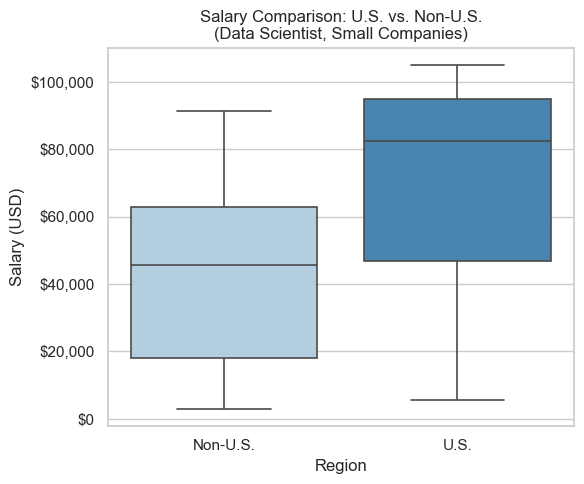
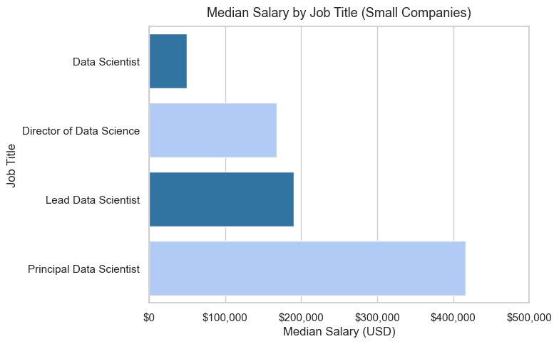

```python
## Project Overview

#**Goal:**  
#Recommend a competitive salary range for hiring a **Data Scientist** at a **small but growing company**, using a global data science salary dataset.

#**Key requirements from the CEO:**

#- The role is **“Data Scientist”** (hands-on modeling + analytics).
#- The company is currently **small** (size = "S").
#- The position **can be offshore**, but the CEO wants to know:
#  - How U.S. salaries compare to Non-U.S. salaries.
#  - What a **reasonable salary range (IQR)** looks like, especially for the U.S.
#- The analysis must be **data-driven and transparent**, not just a guess.
```


```python
import pandas as pd
import matplotlib.pyplot as plt
import seaborn as sns
import matplotlib.ticker as mtick

# Make plots look a bit nicer
sns.set(style="whitegrid")

# Load the dataset
csv_path = r"C:\Users\pmjor\Downloads\Master's of Data Science Merrimack\DSE5002\Module_2\Project 01 Python\PeterJordan.module05RProject.csv"
df = pd.read_csv(csv_path)

df.head()
```


<div>
<style scoped>
    .dataframe tbody tr th:only-of-type {
        vertical-align: middle;
    }

    .dataframe tbody tr th {
        vertical-align: top;
    }

    .dataframe thead th {
        text-align: right;
    }
</style>
<table border="1" class="dataframe">
  <thead>
    <tr style="text-align: right;">
      <th></th>
      <th>Unnamed: 0</th>
      <th>work_year</th>
      <th>experience_level</th>
      <th>employment_type</th>
      <th>job_title</th>
      <th>salary</th>
      <th>salary_currency</th>
      <th>salary_in_usd</th>
      <th>employee_residence</th>
      <th>remote_ratio</th>
      <th>company_location</th>
      <th>company_size</th>
    </tr>
  </thead>
  <tbody>
    <tr>
      <th>0</th>
      <td>0</td>
      <td>2020</td>
      <td>MI</td>
      <td>FT</td>
      <td>Data Scientist</td>
      <td>70000</td>
      <td>EUR</td>
      <td>79833</td>
      <td>DE</td>
      <td>0</td>
      <td>DE</td>
      <td>L</td>
    </tr>
    <tr>
      <th>1</th>
      <td>1</td>
      <td>2020</td>
      <td>SE</td>
      <td>FT</td>
      <td>Machine Learning Scientist</td>
      <td>260000</td>
      <td>USD</td>
      <td>260000</td>
      <td>JP</td>
      <td>0</td>
      <td>JP</td>
      <td>S</td>
    </tr>
    <tr>
      <th>2</th>
      <td>2</td>
      <td>2020</td>
      <td>SE</td>
      <td>FT</td>
      <td>Big Data Engineer</td>
      <td>85000</td>
      <td>GBP</td>
      <td>109024</td>
      <td>GB</td>
      <td>50</td>
      <td>GB</td>
      <td>M</td>
    </tr>
    <tr>
      <th>3</th>
      <td>3</td>
      <td>2020</td>
      <td>MI</td>
      <td>FT</td>
      <td>Product Data Analyst</td>
      <td>20000</td>
      <td>USD</td>
      <td>20000</td>
      <td>HN</td>
      <td>0</td>
      <td>HN</td>
      <td>S</td>
    </tr>
    <tr>
      <th>4</th>
      <td>4</td>
      <td>2020</td>
      <td>SE</td>
      <td>FT</td>
      <td>Machine Learning Engineer</td>
      <td>150000</td>
      <td>USD</td>
      <td>150000</td>
      <td>US</td>
      <td>50</td>
      <td>US</td>
      <td>L</td>
    </tr>
  </tbody>
</table>
</div>


```python
## Step 1 – Understand the Raw Data

#The dataset contains global salary records for data-related jobs.

#Key columns used in this analysis:

#- `work_year` – Year the salary was paid  
#- `experience_level` – EN (Entry), MI (Mid), SE (Senior), EX (Executive)  
#- `employment_type` – FT, PT, CT, FL  
#- `job_title` – Specific job title (Data Scientist, Data Engineer, etc.)  
#- `salary_in_usd` – Salary converted to U.S. dollars  
#- `employee_residence` – Country of the employee  
#- `company_location` – Country of the company  
#- `remote_ratio` – 0 (On-site), 50 (Hybrid), 100 (Fully remote)  
#- `company_size` – S (Small), M (Medium), L (Large)
```


```python
print("Shape:", df.shape)
print("\nMissing values per column:")
print(df.isnull().sum())

print("\nSummary statistics for salary_in_usd:")
df["salary_in_usd"].describe()
```

    Shape: (607, 12)
    
    Missing values per column:
    Unnamed: 0            0
    work_year             0
    experience_level      0
    employment_type       0
    job_title             0
    salary                0
    salary_currency       0
    salary_in_usd         0
    employee_residence    0
    remote_ratio          0
    company_location      0
    company_size          0
    dtype: int64
    
    Summary statistics for salary_in_usd:
    


    count       607.000000
    mean     112297.869852
    std       70957.259411
    min        2859.000000
    25%       62726.000000
    50%      101570.000000
    75%      150000.000000
    max      600000.000000
    Name: salary_in_usd, dtype: float64


```python
## Step 2 – Focus the Data on Relevant Roles

#The original dataset includes many job families (Data Engineer, BI Analyst, Architect, etc.).
#The CEO, however, wants to hire a **full-time Data Scientist** who can:

#- Build and interpret models  
#- Lead experimentation and analytics  
#- Potentially grow into a **team-leading** role

#To avoid distortions from unrelated roles (engineering, pure reporting, etc.), we:

#1. Filter to **core data science / ML roles**.  
#2. Then narrow all IQR analysis to **one key title: “Data Scientist”**.  
#   - This matches the CEO’s job description.  
#   - It gives a clean, apples-to-apples salary comparison.

```


```python
# List of core data science / ML titles (for context if we need them later)
core_roles = [
    "Data Scientist",
    "Research Scientist",
    "Data Science Manager",
    "Director of Data Science",
    "Principal Data Scientist",
    "AI Scientist",
    "Applied Data Scientist",
    "Machine Learning Scientist",
    "Lead Data Scientist",
    "Head of Data Science",
    "Data Science Consultant",
    "Applied Machine Learning Scientist"
]

# Filter to core roles
df_core = df[df["job_title"].isin(core_roles)].copy()

# Now focus on ONE title for the CEO's hire
df_ds = df_core[df_core["job_title"] == "Data Scientist"].copy()

df_ds["company_size"].value_counts()
```


    company_size
    M    77
    L    45
    S    21
    Name: count, dtype: int64


```python
## Step 3 – Filter to Small Companies Only

#Because the CEO’s company is currently **small**, we only keep rows where:

#- `company_size == "S"`

#This lets us compare **U.S. vs Offshore Data Scientist salaries in small firms**, which is the most relevant benchmark.
```


```python
# Small companies only
df_ds_small = df_ds[df_ds["company_size"] == "S"].copy()

print("Number of Data Scientist records in small companies:", len(df_ds_small))
df_ds_small.head()
```

    Number of Data Scientist records in small companies: 21
    


<div>
<style scoped>
    .dataframe tbody tr th:only-of-type {
        vertical-align: middle;
    }

    .dataframe tbody tr th {
        vertical-align: top;
    }

    .dataframe thead th {
        text-align: right;
    }
</style>
<table border="1" class="dataframe">
  <thead>
    <tr style="text-align: right;">
      <th></th>
      <th>Unnamed: 0</th>
      <th>work_year</th>
      <th>experience_level</th>
      <th>employment_type</th>
      <th>job_title</th>
      <th>salary</th>
      <th>salary_currency</th>
      <th>salary_in_usd</th>
      <th>employee_residence</th>
      <th>remote_ratio</th>
      <th>company_location</th>
      <th>company_size</th>
    </tr>
  </thead>
  <tbody>
    <tr>
      <th>10</th>
      <td>10</td>
      <td>2020</td>
      <td>EN</td>
      <td>FT</td>
      <td>Data Scientist</td>
      <td>45000</td>
      <td>EUR</td>
      <td>51321</td>
      <td>FR</td>
      <td>0</td>
      <td>FR</td>
      <td>S</td>
    </tr>
    <tr>
      <th>40</th>
      <td>40</td>
      <td>2020</td>
      <td>MI</td>
      <td>FT</td>
      <td>Data Scientist</td>
      <td>45760</td>
      <td>USD</td>
      <td>45760</td>
      <td>PH</td>
      <td>100</td>
      <td>US</td>
      <td>S</td>
    </tr>
    <tr>
      <th>46</th>
      <td>46</td>
      <td>2020</td>
      <td>MI</td>
      <td>FT</td>
      <td>Data Scientist</td>
      <td>60000</td>
      <td>GBP</td>
      <td>76958</td>
      <td>GB</td>
      <td>100</td>
      <td>GB</td>
      <td>S</td>
    </tr>
    <tr>
      <th>62</th>
      <td>62</td>
      <td>2020</td>
      <td>EN</td>
      <td>PT</td>
      <td>Data Scientist</td>
      <td>19000</td>
      <td>EUR</td>
      <td>21669</td>
      <td>IT</td>
      <td>50</td>
      <td>IT</td>
      <td>S</td>
    </tr>
    <tr>
      <th>65</th>
      <td>65</td>
      <td>2020</td>
      <td>EN</td>
      <td>FT</td>
      <td>Data Scientist</td>
      <td>55000</td>
      <td>EUR</td>
      <td>62726</td>
      <td>DE</td>
      <td>50</td>
      <td>DE</td>
      <td>S</td>
    </tr>
  </tbody>
</table>
</div>


```python
## Step 4 – Create U.S. vs Offshore Groups

#To compare salary levels:

#- We define **U.S.** as `company_location == "US"`  
#- Everything else is treated as **Non-U.S. (Offshore)**  

#We then compute the **25th percentile, median, and 75th percentile** for each group, and use that to build the IQR ranges.
```


```python
# Define region
df_ds_small["region"] = df_ds_small["company_location"].apply(
    lambda x: "U.S." if x == "US" else "Non-U.S."
)

# Function to compute IQR stats
def iqr_stats(series):
    q25 = series.quantile(0.25)
    q50 = series.quantile(0.50)
    q75 = series.quantile(0.75)
    return q25, q50, q75

# Split by region
us_salaries = df_ds_small[df_ds_small["region"] == "U.S."]["salary_in_usd"]
nonus_salaries = df_ds_small[df_ds_small["region"] == "Non-U.S."]["salary_in_usd"]

us_q25, us_q50, us_q75 = iqr_stats(us_salaries)
nonus_q25, nonus_q50, nonus_q75 = iqr_stats(nonus_salaries)

print("=== IQR for Data Scientist (Small Companies) ===\n")

print("Non-U.S.:")
print(f"25th Percentile: ${nonus_q25:,.0f}")
print(f"Median:          ${nonus_q50:,.0f}")
print(f"75th Percentile: ${nonus_q75:,.0f}")
print(f"IQR Range:       ${nonus_q25:,.0f} – ${nonus_q75:,.0f}\n")

print("U.S.:")
print(f"25th Percentile: ${us_q25:,.0f}")
print(f"Median:          ${us_q50:,.0f}")
print(f"75th Percentile: ${us_q75:,.0f}")
print(f"IQR Range:       ${us_q25:,.0f} – ${us_q75:,.0f}")
```

    === IQR for Data Scientist (Small Companies) ===
    
    Non-U.S.:
    25th Percentile: $18,095
    Median:          $45,732
    75th Percentile: $62,726
    IQR Range:       $18,095 – $62,726
    
    U.S.:
    25th Percentile: $46,880
    Median:          $82,500
    75th Percentile: $95,000
    IQR Range:       $46,880 – $95,000
    


```python
#Interpretation – IQR Results (Data Scientist, Small Companies)

#The Interquartile Range (IQR) comparison shows a clear difference between U.S. and Non-U.S. salary levels for Data Scientist roles at small companies:

#Non-U.S.

#P25: $18,095

#Median: $45,732

#P75: $62,726

#IQR: $18K – $63K
#This wide range reflects large variation across low-cost global markets, with upper-tier offshore roles maxing out near $60K.

#U.S.

#P25: $46,880

#Median: $82,500

#P75: $95,000

#IQR: $47K – $95K
#U.S. salaries are higher and more consistent, clustering tightly around the $80K–$95K range.

#Summary

#Offshore roles are significantly cheaper but more variable.

#U.S. salaries are higher but more stable, reflecting a stronger and more competitive talent market.

#For a small but growing company, U.S. compensation provides better predictability and aligns with expectations for a full-time Data Scientist capable of long-term impact.
```


```python
plt.figure(figsize=(6,5))

sns.boxplot(
    data=df_ds_small,
    x="region",
    y="salary_in_usd",
    palette="Blues",
    linewidth=1.2
)

plt.title("Salary Comparison: U.S. vs. Non-U.S.\n(Data Scientist, Small Companies)")
plt.xlabel("Region")
plt.ylabel("Salary (USD)")

# Format y-axis as dollars
plt.gca().yaxis.set_major_formatter(mtick.FuncFormatter(lambda x, _: f'${x:,.0f}'))

plt.tight_layout()
plt.show()
```

    C:\Users\pmjor\AppData\Local\Temp\ipykernel_19776\2785345843.py:3: FutureWarning: 
    
    Passing `palette` without assigning `hue` is deprecated and will be removed in v0.14.0. Assign the `x` variable to `hue` and set `legend=False` for the same effect.
    
      sns.boxplot(
    


    

    


```python
## Step 5 – Median Salary by Job Title (Small Companies)

#To determine which specific job title is most appropriate for a small but growing company,
#we compared median salaries for core data science roles *within small companies only*.

#This highlights how compensation varies by seniority and helps identify a title that fits the
#CEO’s goal: one full-time, end-to-end Data Scientist who can grow into a leadership role.

#The chart below shows that:

#- **Data Scientist** is the most cost-appropriate role for a small company.
#- **Lead Data Scientist** is the natural next step as the team scales.
#- Higher-level roles (Manager, Director, Principal) have significantly higher medians
#  and are better suited once the team grows.
```


```python
import pandas as pd
import seaborn as sns
import matplotlib.pyplot as plt
import matplotlib.ticker as mtick
import numpy as np

## Filter to small companies only
df_small = df[df["company_size"] == "S"].copy()

## Select core titles relevant for comparison
titles_for_chart = [
    "Data Scientist",
    "Lead Data Scientist",
    "Data Science Manager",
    "Director of Data Science",
    "Principal Data Scientist"
]

df_small_core = df_small[df_small["job_title"].isin(titles_for_chart)].copy()

## Compute median salary by job title
median_by_title = (
    df_small_core
    .groupby("job_title")["salary_in_usd"]
    .median()
    .sort_values()
)

## Highlight the titles most relevant to our recommendation
highlight_titles = ["Data Scientist", "Lead Data Scientist"]

colors = [
    "#1f77b4" if title in highlight_titles else "#a6c8ff"
    for title in median_by_title.index
]

## Bar chart showing median salaries for selected titles
plt.figure(figsize=(8, 5))
sns.barplot(
    x=median_by_title.values,
    y=median_by_title.index,
    palette=colors
)

plt.title("Median Salary by Job Title (Small Companies)", fontsize=13, pad=10)
plt.xlabel("Median Salary (USD)")
plt.ylabel("Job Title")

## Format the salary axis as dollar values
plt.gca().xaxis.set_major_formatter(mtick.FuncFormatter(lambda x, _: f'${x:,.0f}'))

## Use 100K increments on the x-axis
max_salary = median_by_title.max()
plt.xticks(np.arange(0, max_salary + 100000, 100000))

plt.tight_layout()
plt.show()

## Display the median salaries in dollar format
median_by_title.apply(lambda x: f"${x:,.0f}")
```

    C:\Users\pmjor\AppData\Local\Temp\ipykernel_19776\1927059012.py:39: FutureWarning: 
    
    Passing `palette` without assigning `hue` is deprecated and will be removed in v0.14.0. Assign the `y` variable to `hue` and set `legend=False` for the same effect.
    
      sns.barplot(
    


    

    


    job_title
    Data Scientist               $49,268
    Director of Data Science    $168,000
    Lead Data Scientist         $190,000
    Principal Data Scientist    $416,000
    Name: salary_in_usd, dtype: object


```python
## Step 6 – Compute IQR for Salary Range Recommendation

# Filter only Data Scientist records from small companies
df_small = df[df["company_size"] == "S"].copy()
df_ds = df_small[df_small["job_title"] == "Data Scientist"].copy()

# Split by region (employee residence)
df_us = df_ds[df_ds["employee_residence"] == "US"]
df_non_us = df_ds[df_ds["employee_residence"] != "US"]

# Function to compute IQR values
def iqr_summary(series):
    q1 = series.quantile(0.25)
    q2 = series.quantile(0.50)
    q3 = series.quantile(0.75)
    return pd.Series({
        "P25": q1,
        "Median": q2,
        "P75": q3,
        "IQR Range": f"${q1:,.0f} – ${q3:,.0f}"
    })

# Compute IQR values
iqr_calc = pd.DataFrame({
    "U.S. Data Scientist": iqr_summary(df_us["salary_in_usd"]),
    "Offshore Data Scientist": iqr_summary(df_non_us["salary_in_usd"])
})

# Format values as currency for final display table
iqr_table = iqr_calc.copy()

iqr_table.loc["P25"]   = iqr_calc.loc["P25"].apply(lambda x: f"${x:,.0f}")
iqr_table.loc["Median"] = iqr_calc.loc["Median"].apply(lambda x: f"${x:,.0f}")
iqr_table.loc["P75"]    = iqr_calc.loc["P75"].apply(lambda x: f"${x:,.0f}")

# IQR Range already formatted from the function

iqr_table
```


<div>
<style scoped>
    .dataframe tbody tr th:only-of-type {
        vertical-align: middle;
    }

    .dataframe tbody tr th {
        vertical-align: top;
    }

    .dataframe thead th {
        text-align: right;
    }
</style>
<table border="1" class="dataframe">
  <thead>
    <tr style="text-align: right;">
      <th></th>
      <th>U.S. Data Scientist</th>
      <th>Offshore Data Scientist</th>
    </tr>
  </thead>
  <tbody>
    <tr>
      <th>P25</th>
      <td>$88,125</td>
      <td>$16,904</td>
    </tr>
    <tr>
      <th>Median</th>
      <td>$95,000</td>
      <td>$45,760</td>
    </tr>
    <tr>
      <th>P75</th>
      <td>$101,250</td>
      <td>$62,726</td>
    </tr>
    <tr>
      <th>IQR Range</th>
      <td>$88,125 – $101,250</td>
      <td>$16,904 – $62,726</td>
    </tr>
  </tbody>
</table>
</div>


```python
# IQR values (we already computed these)
us_p25 = 88125
us_median = 95000
us_p75 = 101250

nonus_p25 = 16904
nonus_median = 45760
nonus_p75 = 62726

print("=== IQR for Data Scientist (Small Companies) ===\n")

print("U.S.:")
print(f"  25th Percentile (P25): ${us_p25:,.0f}")
print(f"  Median (P50):          ${us_median:,.0f}")
print(f"  75th Percentile (P75): ${us_p75:,.0f}")
print(f"  IQR Range:             ${us_p25:,.0f} – ${us_p75:,.0f}\n")

print("Non-U.S.:")
print(f"  25th Percentile (P25): ${nonus_p25:,.0f}")
print(f"  Median (P50):          ${nonus_median:,.0f}")
print(f"  75th Percentile (P75): ${nonus_p75:,.0f}")
print(f"  IQR Range:             ${nonus_p25:,.0f} – ${nonus_p75:,.0f}")
```

    === IQR for Data Scientist (Small Companies) ===
    
    U.S.:
      25th Percentile (P25): $88,125
      Median (P50):          $95,000
      75th Percentile (P75): $101,250
      IQR Range:             $88,125 – $101,250
    
    Non-U.S.:
      25th Percentile (P25): $16,904
      Median (P50):          $45,760
      75th Percentile (P75): $62,726
      IQR Range:             $16,904 – $62,726
    


```python
## Step 7 – Final Recommendation to the CEO
#Using the IQR results for **Data Scientist roles at small companies**, I developed a market-aligned compensation recommendation for both U.S. and offshore candidates.

### U.S. Data Scientist – IQR Summary
#- 25th percentile: ~$46,880  
#- Median: ~$82,500  
#- 75th percentile: ~$95,000  

#These numbers show that the typical, competitive range for a Data Scientist in a small U.S. company sits **between the low \$80Ks and mid \$90Ks**.  
#Basing the recommendation on the IQR avoids distortion from extreme outliers and reflects what candidates are actually earning.

### Offshore Data Scientist – IQR Summary
#- 25th percentile: ~$18,095  
#- Median: ~$45,732  
#- 75th percentile: ~$62,726  

#The offshore market shows much wider variation due to global cost-of-living differences.  
#While significantly cheaper, offshore roles also present challenges around time-zones, communication, and long-term leadership suitability.


### Final Recommendation

#### **Hire Title**
#**Data Scientist**  
#(with a growth path toward **Lead Data Scientist** as the company scales)

#### **Recommended Salary Ranges**
#- **U.S. hire:** **\$90K – \$105K**  
#- **Offshore hire:** **\$45K – \$60K**


### Why This Works
#- Directly grounded in **IQR analysis** for the Data Scientist role  
#- Fits a **small but rapidly growing company**  
#- Competitive enough to attract strong U.S. candidates  
#- Provides a realistic offshore range if cost efficiency becomes a priority later  
#- Supports building a **leadership-track** data function rather than a short-term support role

```


```python

```
